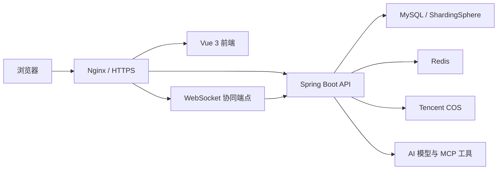

# LiPictureCloud 智能云图库

> 面向个人与团队的智能图片资产管理平台，覆盖图片上传、检索、审核、空间权限、实时协同编辑、AI 生图和图库分析，并完成 Docker 化生产部署。

[](https://github.com/53214mm/li_picture_cloud/actions/workflows/ci.yml)


**线上体验：** [https://lipicturecloud.com](https://lipicturecloud.com)（不提供公共测试账号）

## 项目亮点

- 以公共图库、个人空间和团队空间构建完整的图片资产管理模型，覆盖上传、检索、审核、编辑、下载和批量处理。
- 使用角色与权限码统一约束 HTTP 接口和 WebSocket 协同操作，权限不只依赖前端隐藏按钮。
- 团队成员可实时观察左旋、右旋、放大、缩小等编辑动作；查看者只读，编辑者和管理员可以提交操作。
- AI 对话采用流式响应，MCP 生图工具按当前登录用户隔离，生成图片保存到正确的个人空间。
- 使用 Redis、ShardingSphere、Tencent COS、Docker Compose 和 Nginx 完成缓存、会话、分表、对象存储与生产部署治理。

## 项目简介

LiPictureCloud 不只是图片上传页面，而是一套围绕“图片资产如何被存储、共享、协作和分析”构建的业务系统。

普通用户可以管理自己的图片和个人空间，也可以加入团队空间；团队创建者能够分配查看者、编辑者和管理员角色。平台管理员负责公共图片审核与用户治理。团队成员编辑同一张图片时，其他在线成员可以实时看到操作和图片状态，查看者能够观看协同过程但不能篡改权威状态。

系统还接入 AI 对话和 MCP 生图能力，生成结果会按当前会话用户入库；图库分析模块可从容量、数量、分类、标签、文件大小和上传趋势等维度观察空间使用情况。

## 核心业务能力

| 模块 | 已实现能力 |
| --- | --- |
| 图片管理 | 本地文件与 URL 上传、批量抓取、分页检索、图片审核、编辑、下载、批量管理 |
| 空间体系 | 公共图库、个人空间、团队空间、空间级别、容量和数量限制 |
| 团队权限 | 查看者、编辑者、管理员角色，成员添加、修改、移除与后端权限校验 |
| 实时协同 | WebSocket 握手鉴权、在线状态、旋转与缩放操作、只读观看、跨实例事件同步 |
| AI 能力 | SSE 流式对话、图片生成意图识别、MCP 工具调用、生成图片自动入库与用户归属隔离 |
| 图库分析 | 空间用量、分类分布、标签热度、图片大小分布、上传趋势和管理员空间排行 |
| 平台治理 | 用户管理、图片审核、统一异常响应、请求限流、缓存降级与生产种子模板 |

## 技术架构



- **Nginx** 统一承接 HTTPS、静态页面、REST API、SSE 流和 WebSocket 升级请求。
- **Spring Boot** 承载图片、空间、成员、权限、AI、分析和管理端业务。
- **MySQL / ShardingSphere** 保存核心业务数据，并支持普通、静态分表、动态分表三种运行方式。
- **Redis** 承担分布式 Session、AI 对话记忆、二级缓存、限流以及协同权威状态与 Pub/Sub 事件。
- **Tencent COS** 保存原图、缩略图和 AI 生成图片，业务数据库记录资源元数据和归属关系。
- **AI 模型与 MCP 工具** 提供流式问答、图片生成及生成结果回收能力。

## 技术栈

| 分类 | 技术 |
| --- | --- |
| 后端 | Java 21、Spring Boot、Spring MVC、MyBatis-Plus、Sa-Token、Spring AOP、Knife4j |
| 数据与中间件 | MySQL 8、Redis 7、Caffeine、Spring Session、ShardingSphere |
| AI 与存储 | Spring AI Alibaba、MCP Client、DashScope / 百度千帆、Tencent COS |
| 前端 | Vue 3、Pinia、Vue Router、ECharts、Axios、Vite |
| 工程与部署 | Maven Wrapper、Node Test、ESLint、GitHub Actions、Docker Compose、Nginx |

## 核心技术难点

### 1. 在 REST 与 WebSocket 之间统一团队权限

**问题：** 只在 Controller 或前端按钮上校验权限，会让 WebSocket 握手和消息发送形成新的越权入口。

**设计：** 将空间所有者、平台管理员、团队成员角色统一映射成权限码；HTTP 资源访问、WebSocket 握手和协同消息处理均调用同一套授权语义。`collaboration:join` 控制能否进入房间，`collaboration:edit` 控制能否发送编辑操作。

**结果：** 查看者可以进入房间接收事件，但伪造编辑消息仍会被后端拒绝，使不同传输协议下的权限规则保持一致。

### 2. 只读观看与可编辑协同分离

**问题：** “能看到别人操作”不等于“能修改图片”，仅依靠前端禁用按钮无法保护团队图片状态。

**设计：** 服务端维护图片的旋转角度、缩放比例和版本号等权威状态；编辑命令先校验角色和版本，再通过 Redis Lua 原子应用。事件经 Redis Pub/Sub 分发到不同后端实例，查看者只消费权威事件。

**结果：** 编辑者和管理员能够双向协作，查看者可以实时观看操作提示和图片变化，却不能改变房间状态。

### 3. Redis 的职责边界与降级策略

**问题：** 登录态、热点查询、AI 记忆和实时协同都需要跨请求或跨实例状态，但它们对一致性和失败处理的要求不同。

**设计：** Spring Session 保存登录态；Redis ChatMemory 保存有限长度的对话历史；Caffeine + Redis 组成图片查询二级缓存并允许 Redis 故障时回源数据库；协同状态则使用 Lua 和 Pub/Sub 保证原子更新及跨实例传播。

**结果：** 不同状态按一致性要求选择存储方式，普通查询可降级，协同权威状态保持版本化和幂等处理。

### 4. AI 工具调用中的用户上下文隔离

**问题：** MCP ToolCallback 由 Provider 缓存时，如果原地包装并绑定用户，会造成后续请求继承首个用户上下文，生成图片可能错误归属其他账号。

**设计：** 每次请求基于原始 ToolCallback 创建独立的用户上下文包装，不修改 Provider 返回的共享数组；MCP 返回图片地址后，由当前请求用户对应的持久化服务写入个人空间。

**结果：** 避免跨用户上下文污染，并让 AI 生图的资源归属可以从请求到数据库完整追踪。

### 5. 可切换的静态与动态分表

**问题：** 分表功能既要验证路由算法，也不能让本地开发和功能测试被复杂的数据源配置绑死。

**设计：** 使用 Spring Profile 拆分普通数据源、`sharding-static` 和 `sharding-dynamic` 配置；静态方案通过标准分片规则路由，动态方案由 `DynamicPictureShardingAlgorithm` 根据分片键选择目标表。不开启分表 Profile 时使用普通数据源。

**结果：** 分表能力能够独立启用、测试和关闭，降低开发环境与生产扩展方案之间的耦合。

### 6. 资源受限服务器上的生产部署

**问题：** 同一台服务器还运行其他 Docker 项目，直接映射常见端口或无限制占用内存会影响现有服务。

**设计：** MySQL、Redis、后端和前端只加入独立 Docker 网络，不暴露宿主机业务端口；公共 Nginx 按域名反向代理。Compose 为各容器配置健康检查、日志轮转和内存上限，密钥通过 `.env` 外部注入。

**结果：** 项目可以与服务器上的其他应用共存，并具备明确的健康检查、更新、备份和故障排查路径。

## 工程质量

- GitHub Actions 执行后端构建、测试、Redis 协同集成测试和前端验证。
- 后端使用 Maven Wrapper 固定构建入口，测试覆盖授权、协同状态、Redis 事件、AI 上下文、分表算法等关键路径。
- 前端使用 Node 原生测试、ESLint、Vite 构建和产物体积检查。
- 后端和前端使用多阶段 Docker 构建，运行镜像不携带完整编译环境。
- 生产配置通过环境变量外部化，仓库只保留 `.env.example` 和本地配置示例。
- 开发种子与生产种子模板分离，生产账号要求使用 BCrypt strength 12 密文。

在本地执行完整后端验证：

```powershell
./mvnw verify
```

执行前端验证：

```powershell
cd li-picture-cloud-frontend
npm ci
npm test
npm run lint
npm run build
npm run check:bundle
```

## 快速开始

### 环境要求

- JDK 21
- Node.js 22
- MySQL 8
- Redis 7

COS、AI 和 MCP 功能还需要自行申请对应服务的合法凭证。请勿把真实密钥写入仓库。

### 1. 初始化数据库

依次执行 `sql/` 目录中的表结构脚本，并根据本地或生产环境选择正确的种子脚本。详细说明见[用户种子数据教程](docs/round-17-user-seed-guide.md)。

### 2. 配置并启动后端

复制本地配置示例，或在 IDE / Shell 中配置数据库、Redis、COS 和 AI 环境变量：

```powershell
./mvnw spring-boot:run
```

默认后端端口为 `8124`。

### 3. 启动前端

```powershell
cd li-picture-cloud-frontend
npm ci
npm run dev
```

### 4. 使用 Docker Compose

```bash
cp .env.example .env
docker compose --env-file .env up -d --build
```

必须先将 `.env` 中的数据库、Redis、COS 和 AI 配置替换为自己的值，并确保 `.env` 不会被提交。生产服务器部署、Nginx 接入、HTTPS、备份和回滚步骤见[OpenCloudOS Docker 部署教程](docs/round-18-docker-deployment-guide.md)。

## 项目结构

```text
.
├─ src/main/java/                  Spring Boot 后端业务代码
├─ src/main/resources/             环境、权限和分表配置
├─ li-picture-cloud-frontend/      Vue 3 前端
├─ deploy/nginx/                   HTTP、HTTPS 与流式代理模板
├─ sql/                            表结构、开发种子和生产安全模板
├─ docs/                           分轮治理、使用与部署教程
├─ compose.yaml                    生产容器编排
├─ Dockerfile                      后端多阶段构建
└─ pom.xml                         Maven 依赖与构建配置
```

## 文档导航

- [Java 后端校招面试十天冲刺指南](docs/interview/00-冲刺使用指南.md)

- [团队空间与协同编辑使用指南](docs/round-15-team-space-guide.md)
- [密码与 AI 安全治理指南](docs/round-16-password-ai-security-guide.md)
- [用户种子数据指南](docs/round-17-user-seed-guide.md)
- [OpenCloudOS Docker 部署教程](docs/round-18-docker-deployment-guide.md)
- [当前未决问题](docs/未决问题.md)

## 已知边界与后续规划

- 线上环境已开放访问，但不提供公共测试账号，避免测试数据和第三方 AI 配额被滥用。
- COS、DashScope、百度千帆和 MCP 服务依赖使用者自行准备有效凭证，外部服务不可用时对应功能会受到影响。
- ShardingSphere 提供可选的静态与动态分表配置；默认运行方式不强制开启分表。
- 当前代码已经对授权、协同等核心领域做了局部边界整理，完整 DDD 架构迁移仍属于后续演进方向，不作为已完成成果展示。
