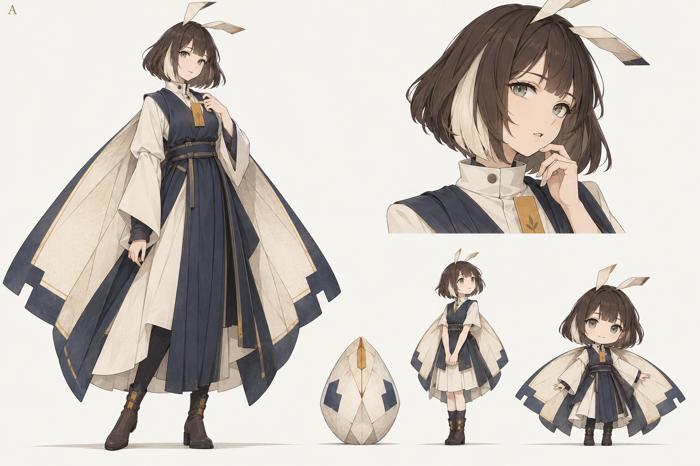
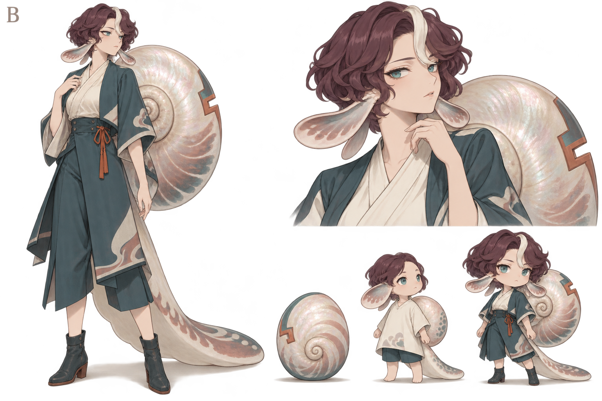
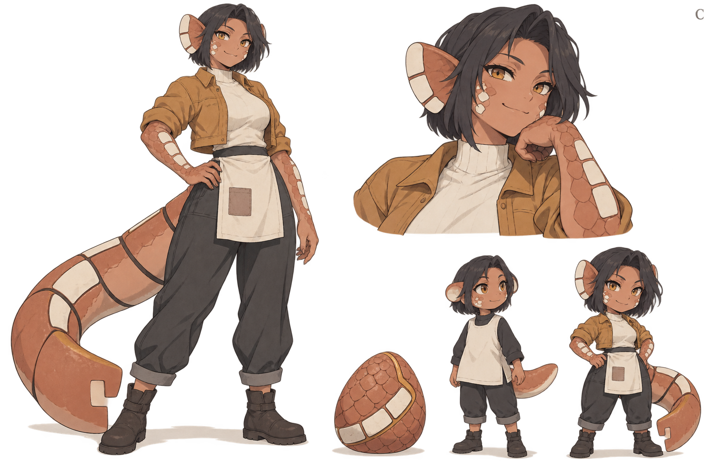

# R05 — 第一位原创伙伴概念探索

日期：2026-09-23。**正式选择绫页 / 纸翼蛾族作为第一 Species；Egg、Juvenile、Adult 视觉方向均已接受。B 汐砚、C 陶眠冻结留档。** 当前名称继续使用绫页，本轮不重命名；未来正式 IP / 商标 / 相似性检查单独安排。

最新人工指示：Web Adult 使用下方设定页左侧的正常比例全身方向；右下角 Q 版仅作未来 Codex 式桌宠参考，不是 Juvenile 或 Web Home 主体。未成熟体对话使用自身形象的头肩近景。首版技术已选 Sprite + 静态 / 表情差分 Portrait。本轮不再发散或重画，只收口文档与第二阶段计划。

初轮使用内置 imagegen 生成三张探索设定页，无现有动漫/游戏角色图片作参考。concept-a.png 与 concept-a-ui.png 仍是 Exploratory Concept Art：不能直接切成动画 Sprite Sheet、接入产品或当作 Live2D / Spine 模型。第二阶段要按已选方向制作独立生产资产，不重新竞选角色。AI 生成不等于已证明全网唯一，后续权利与相似性检查不改变当前名称统一使用绫页的决定。

## 1. 历史比较：保留选择依据，不重新发散

| 维度 | A · 纸翼蛾族「绫页」 | B · 潮壳螺族「汐砚」 | C · 陶鳞蜥族「陶眠」 |
| --- | --- | --- | --- |
| 身份位置 | 林缘留影室出身的纸翼居民 | 海岸聚落出身的潮壳居民 | 山脚陶窑聚落出身的陶鳞居民 |
| 人格底色 | 细看、求证，有自己的整理秩序 | 慢听、不急着下结论，重视分寸 | 动手、直接，欣赏尝试与返工 |
| 大剪影 | 上窄下宽的双折页翼 | 单侧螺旋背壳 + 低平长尾，逗号形 | 方短发 + 稳定裤装 + 厚宽陶尾，L 形 |
| 非人特征 | 生物纸翼、折片触角 | 螺壳、感知鳍、软体低尾 | 陶鳞、鳍状耳板、分节尾 |
| 图片主题 | 边缘、构图与被保留的细节 | 同一画面里可以有不同的解释 | 作品制作过程、修改留下的痕迹 |
| 生活倾向 | 整理书页，喜欢留出空白 | 靠窗听远处的声音，慢慢回看 | 修补和摆弄物件，愿意先试一下 |
| 主要动画 | 翼缘开合、触角折动、翻看 | 鳍片轻摆、壳旁转身、尾部收拢 | 尾部落地、伸展、蹲坐、侧看 |
| 最有希望的表现 | Shell 小轮廓与安静 Home | 对话半身与同住感 | Home 全身动作与性格反应 |
| 主要代价 | 翼可能看成披风，纸纹缩小后丢失 | 壳厚度、方向和透明材质难统一 | 尾巴横向占位大，走路/转身成本高 |

初轮共同的「偏移画框缺角」在三者身上分别是翼缘、壳缘、尾端结构。该比较保留探索价值，不是要求重新组合三套特征；第二阶段沿已选绫页方向制作。

## 2. A · 绫页 / 纸翼蛾族

### 身份与相处

纸翼蛾族的翅脉像纸页的折线，习惯在林缘干燥、采光好的地方生活。绫页对「你为什么留下这张图」比对标签数量更好奇。她愿意慢慢理解，但不擅长一边做事一边被打断，也会对含糊的解释追问。

官方身份只规定文化与倾向，不预写「你们一起整理过相册」。陌生时她可能问：「右边那一小块，你也想留在画面里吗？」熟悉后，如果确有已确认共同经历，才可以说：「你上次提过那段屋顶，这次补好了？」这是表现范围示例，不改聊天 Prompt。

### 可交给画师的 Art Brief

- **正面与 silhouette**：Adult 正常比例约六头身，肩部简洁，翼从背侧向下形成偏矩形的钟形。两片大翼的外缘有一处偏移缺角；合翼也能辨认。侧面要画出翼根，避免只像披风。
- **发型 / 面部**：暖深棕齐短发，一块宽的象牙色内层发束；灰绿眼，眉形自然，不永久微笑。无需腮红和星星眼维持可爱。
- **种族特征**：两支短扁折片触角；生物翼有纸样质感但能弯折。限制为这两组核心结构，不再加尾巴、角、光环。
- **服装**：象牙色高领内衫、靛墨色无袖褶叠外衣、实用短靴；胸前一片赭黄色书签形布片。衣服与翼分开，不靠堆叠丝带做辨识。
- **材质**：棉麻、哑光靴、柔韧纸样翼。大色块优先，纸纹只保留在近景。
- **色板**：靛墨 `#374761` / 象牙 `#eee7d8` / 蜂蜜赭 `#c49245`；发色 `#453a34`。强调色集中在胸前小块。

### 三阶段

| Egg | Juvenile | Adult |
| --- | --- | --- |
| 已接受：扁梨状折脊壳、靛墨缺角纹与赭色合缝 | 已接受：当前概念图较短服装、纸翼与触角的未成熟形态；对应半身近景也保留 | 已接受：正常比例全身、完整双翼、双折触角与纵向叠衣 |

三项 DNA：折脊 / 偏移缺角 / 单点赭色。幼体是幻想形态未成熟，不按幼儿年龄制作。此前要求改成“短闭翼袋 + 直筒罩衫”的方案不再是强制生产规格；以用户已接受的当前图为方向，后续只优化一致性与交付细节。

### 表现与成本

Web Scene 使用左侧正常比例全身立绘，保留宽翼外轮廓和胸前色点，按比例缩放，不改成 Q 版；Shell 的小尺寸表现若不够清楚，后续另行讨论简化方式，当前保留文字入口。Portrait 必须露出触角、发束、领口与一小段翼缘，不能裁成普通棕发女孩。Idle 可先用眨眼与微小合翼，未来 Sleep 将翼收成可辨识的纸帐形；Thinking 可略偏头并静止触角。Feed 是接住用户递来的图像注意力，不咀嚼 PNG。Q 版只在独立桌宠参考区展示。

生产时仍需处理宽翼包围盒、长褶子的帧间稳定性和 Shell 减细节版。**用户已接受当前 Juvenile，初轮否定其结构差异并要求返工的结论已撤销，不再作为第二阶段阻塞项。** 三阶段方向接受与生产资产验收是两件事：透明边缘、锚点、动作一致性仍在实际交付时检查。

## 3. B · 汐砚 / 潮壳螺族（冻结档案）

以下为初轮探索记录，暂不继续迭代或在当前原型中切换；图像和设定保持留档。

### 身份与相处

潮壳螺族的背壳随生长形成环层，来自海岸浅滩与陆地之间的聚落。她可以在小屋生活，不需把 Home 变成水族箱。她擅长把听来的话放一会再回答，会说「我还没想明白」，也不喜欢被催着赞同。

贝壳的环层是经历沉积的视觉比喻，不是把每张用户照片永久刻进壳里。否则删除记忆与身体表现会产生矛盾。她的候选语气：「画面很安静。拍的时候也这么安静吗？」关系更熟时仍应接受用户不讲背景。

### 可交给画师的 Art Brief

- **正面与 silhouette**：正常比例约六头身，人形躯干背后连接一个低位偏侧的螺旋壳，身体旁形成逗号轮廓。尾巴低平向一侧收拢，轮廓与壳不可混为一团。
- **发型 / 面部**：梅褐色短波纹发，一束奶白弯形前发；灰青眼，表情平静且略有自己的判断，不用困倦脸当唯一性格。
- **种族特征**：成对圆钝的感知鳍，单一螺壳和低平软尾。壳有明确连接位置，不能像背包；鳍不画成普通精灵耳。
- **服装**：奶白包裹式衬衣、深青不对称短外衣与宽短裤/裙裤、平底短靴，一根小陶红系绳。避免水手制服、贝壳比基尼与湿身效果。
- **材质**：哑光布、少量贝母漫反射；Shell 取消密集珠光。不是玻璃透明壳，也不实现复杂透光 shader。
- **色板**：深潮青 `#315c5d` / 奶白 `#eee2d0` / 陶红 `#b9654b`，发色 `#66464e`。

### 三阶段

| Egg | Juvenile | Adult |
| --- | --- | --- |
| 扁透镜状、螺旋叠层卵，外缘有潮青带和陶红缺口 | 平滑小壳尚无明显螺旋；短厚尾、短鳍；奶白直罩衫与短裤 | 完整螺旋与两片感知鳍，长而低的尾，成熟外衣 |

三项 DNA：螺旋趋势 / 白色弧形发束或壳纹 / 潮青缺角边。成熟体的 Q 版也要有完整螺壳；不能只依据头身比判断阶段。

### 表现与成本

Portrait 适合细微眉眼和停顿，壳边与鳍必须入镜。Scene 的壳可作为稳定大色块，低尾需要与地面有间距。未来 Happy 可通过鳍轻轻张开、Thought 通过视线与微转头表达，不每次大幅摆壳。换装不换壳，不改变身份。

风险在于半透明高光放到 48px 后变成杂色；壳的左右不对称限制简单水平翻转；转身需要补结构视图。当前探索图 Juvenile 偏低龄，需要以四头身的非现实年龄形态和更明确的未成熟鳍壳重画；不将这张图直接作为幼体生产稿。小尺寸优先减少壳上的亮斑。

## 4. C · 陶眠 / 陶鳞蜥族（冻结档案）

以下为初轮探索记录，暂不继续迭代或在当前原型中切换；图像和设定保持留档。

### 身份与相处

陶鳞蜥族来自山脚温暖的陶窑聚落，身体具有哑光陶样鳞片，不是机械人或火元素化身。陶眠喜欢观察一件东西是怎么做出来的，愿意动手试，也可能直接说「这一版边上歪了」。她不以夸奖所有结果为职责，但不会把用户的失败当笑料。

图片主题是制作与返工的痕迹。候选台词：「这块接缝是后来补的？我想听你怎么改的。」面对纯风景也能相处，不把所有图片都解释成工艺教程。她可以有不擅长的事，例如总急着动手而忽略先听完。

### 可交给画师的 Art Brief

- **正面与 silhouette**：稳健的人形躯干、短方发、宽裤腿，低垂厚尾在地面形成 L 形。尾端扁宽，有一处象牙色缺角嵌片；不是武器。
- **发型 / 面部**：炭灰短发，不对称发缝；琥珀眼，眉形清晰，颊侧少量陶鳞。成熟而有精神，不采用幼儿面部与成年身体组合。
- **种族特征**：两片圆钝鳍状耳板、前臂陶鳞、单条分节尾。没有角、翅膀或全身发光裂纹。
- **服装**：赭黄短工装外套、象牙高领内衫、炭灰宽裤、平底靴、短围裙一个方补丁。移除工具腰带与繁多袋子，动作才易读。
- **材质**：哑光陶、厚棉、磨砂靴；鳞片只在脸、前臂和尾上建立主次。
- **色板**：陶土 `#b5684e` / 炭灰 `#343333` / 赭黄 `#bc8d44` / 象牙嵌片 `#eee2cc`。

### 三阶段

| Egg | Juvenile | Adult |
| --- | --- | --- |
| 不对称扁卵石轮廓，陶鳞包壳，一圈象牙嵌带和封闭赭缝；不是燃烧矿石 | 平滑短尾、未硬化小耳鳍、简单罩衫；鳞板尚未分节 | 完整分节陶尾与耳板、短外套和围裙；身体重心更稳 |

三项 DNA：陶鳞嵌带 / 圆钝耳板轮廓 / 尾端缺角。未成熟阶段仍需更明确的软鳍和低鳞片密度，不只是减少配饰。

### 表现与成本

Scene Sprite 的大尾与站姿使「她住在这里」容易成立；未来可以靠尾支撑坐下、伸展或低头检查物件。Portrait 保留耳板和颊鳞，不把种族信息全裁在画面外。Annoyed 可以眉形与尾巴静止表达，不制作攻击动作。

风险是尾部扩大包围盒，尤其 88px 侧栏；过多鳞片会增加手绘帧成本。当前成年 Q 版仍偏五官细碎，64px 应合并尾鳞为三到四块。当前图幼体和成体衣服/尾长已有区别，但鳞片成熟度仍需在母版中进一步拉开。

## 5. 图像复核结果与保留问题

| 检查 | 当前探索结论 |
| --- | --- |
| 三套不同轮廓 | A 双翼、B 背壳、C 长陶尾，差异成立；不是同一个女孩换发色 |
| Adult / Portrait 一致 | 发型主分区、眼色、衣服锚点及种族特征大致一致，足以讨论方向；未做逐像素设定校验 |
| 蛋方向 | A Egg 已获用户接受；未来新 Species 的获取 / 孵化业务另做领域设计，不让旧伙伴倒退成蛋 |
| Juvenile 方向 | A 已获用户接受，撤销返工阻塞；B/C 的初轮意见仅保留在冻结档案，不在第二阶段处理 |
| 透明通道 | A 原图为 RGB，另用 imagegen 生成 RGBA 的 UI 去背景预览副本；B/C 为 RGBA；保留原始文件，未当成统一 alpha 生产包 |
| 动画 | 没有骨骼、拆层或真正帧序列；原型的 CSS 轻动只是位置感示意 |
| 小尺寸 | 用原型 48/64/80px 成年缩略图作观察，生产 Sprite 需重画简化；不把设定页的裁切当最终 Sprite |
| 原创性 | 无现成角色图作输入，方案由本轮原创 Art Brief 生成；未完成全网相似性与名称权利检索 |

## 6. 选择已完成，后续只做生产准备

绫页的纸翼、留白与图片主题形成首位伙伴的身份；用户已经选定该方向与三阶段视觉。B 的倾听、C 的动作感保留为历史比较价值，不继续迭代，也不承诺成为下一批正式 Species。

首版准备 Adult Home 全身、Shell 简化静态、Neutral Portrait 和一个最小 Idle；必要时加 1～2 个表情差分。三阶段接受不等于首版必须全部显示：已有伙伴先保留真实 lifeStage，采用单实例视觉兼容策略，不重新孵化。具体交付、画幅与验证见[第二阶段实施计划](R05-第二阶段实施计划.md)。
