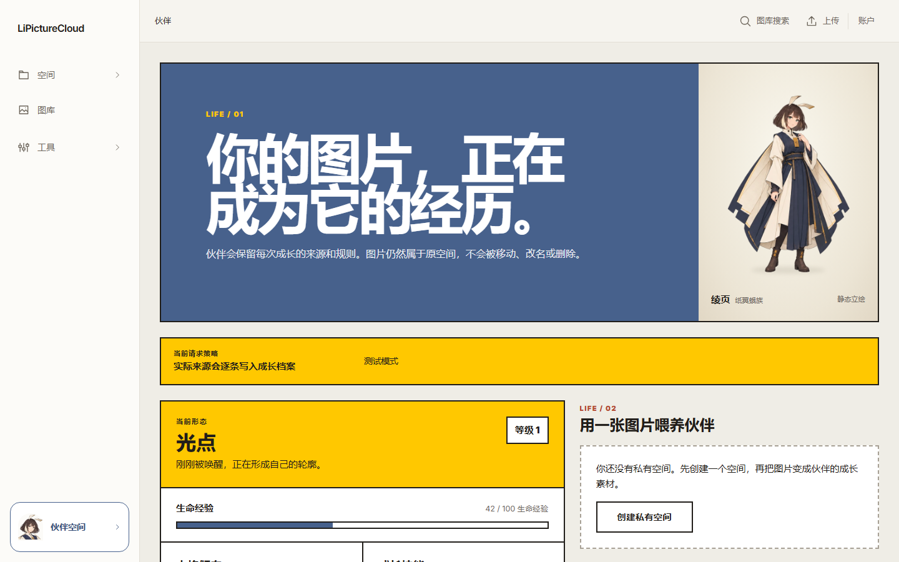
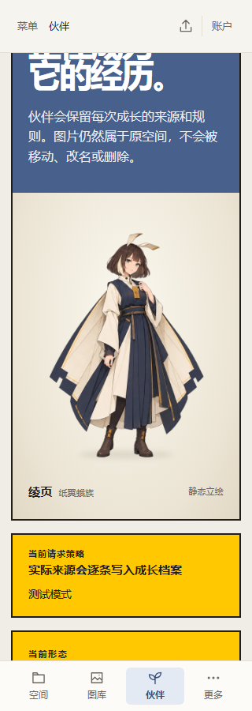
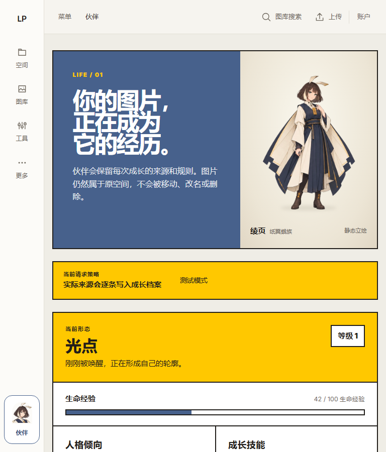
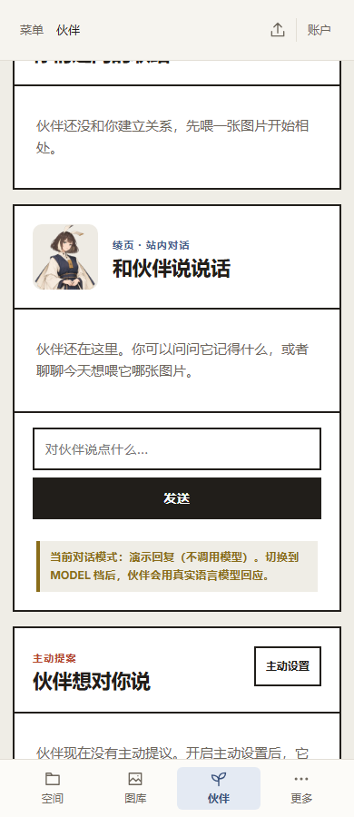

# R05 第二阶段实施记录

2026-09-24 用户明确要求「执行第二阶段」，技术实现与本机回归完成；**2026-09-26 用户已授权「提交并推送」。** 实施基线 `41c4e6c`，保留 `feat/r05-companion-identity` 分支和工作区其他修改。

## 规格与边界

- 按已审阅计划执行：独立生产资产 → 轻量表示层 → Shell / Home 主视觉 / Chat 接入 → 单一 Idle → 兼容与界面验证。
- 首发现有单实例统一使用正常比例 Adult 身体。`currentStage` 保留后端值，`visualStage` 只用于本地美术；未知阶段静态降级。未加载、失败、无实例沿用原页面分支。
- 静态 Shell 固定 40×44，采用正常比例头肩缩略；Portrait 桌面 104×104、手机 72×72；Home 正常比例全身，最大显示宽 336px，手机 272px。
- 运行资源预算在导出前设定：Home 首帧 ≤ 240 KiB、Idle ≤ 480 KiB、Portrait ≤ 120 KiB、Shell ≤ 16 KiB；总计 ≤ 856 KiB。解码 RGBA 总量 ≤ 10 MiB。母版保留在文档资产目录，不由页面请求。
- 动作只有眨眼：睁眼 4200ms、闭眼 140ms。静态第一帧与动画同源、同尺寸和落脚位置。其他表情暂不投放。
- 不改后端、数据库、业务 API、真实生命周期或成长规则；Q 版和 B/C 保持探索归档。

## A～H 交付情况

| 单元 | 结果 |
| --- | --- |
| A 生产资产 | 独立成年母版、透明两帧眨眼母版、Neutral 半身母版、Shell 简化头肩母版；原始 PNG 和全部提示词归档。没有直接裁切概念设定页上线。 |
| B 表示层 | `body/` 内 Body、Portrait、Presence、Artwork、SpritePlayer 和本地清单；阶段适配与单计时器逻辑独立。没有引擎注册器、全局业务 store 或新依赖。 |
| C Shell | 保留原 40×44 槽位、链接文字、aria-current 和焦点行为。入口静态，抽屉关闭时不挂载其角色副本；Shell 不预取 Home 图集。 |
| D Home | 仅已有实例时替换 Hero 光团；未加载 / 错误 / 无实例 / 唤醒流程保留。全身落地承托与图内留白独立于原业务面板。 |
| E Conversation | 头部一处 Neutral 半身像；不按文本、发送状态或 Mood 猜表情，不改 history / streaming / 草稿 / 重试实现。 |
| F 最小 Idle | 两帧眨眼、4200/140ms；用户暂停 / 恢复、减少动态效果、后台事件、离屏、弹层和卸载处理已验证。失败回首帧，首帧失败回带名称的占位。 |
| G 旧伙伴兼容 | 三种真实阶段值及未知阶段通过前端夹具；真实 LIGHT 实例的身份、经验、技能、人格、成长档案、聊天、记忆、契约、提案和稳定关系字段在显示与刷新前后相同，展示没有 Companion 写请求。 |
| H 验证 | 67 项 Node 测试、31 项浏览器用例、lint、开/关生产构建与包体预算通过；桌面截图已检查，手机/平板为浏览器视口模拟。用户已授权提交推送；实体移动设备性能仍未验证。 |

G 的限制：没有为了测试伪造后端生命周期或修改数据库，将三个阶段值的 UI 适配验证与真实已成长 LIGHT 实例回归分开记录。Mood 和近期反馈是随时间衰减的读取视图，没有用它们的逐字节相等冒充持久化验证；本次没有修改其业务代码或新增写请求。

## 资产清单与测量

运行资产：[manifest.json](../li-picture-cloud-frontend/src/assets/companion/lingye/manifest.json)。生产母版与内置 imagegen 提示词：[production/lingye-v1/PROMPTS.md](design-exploration/r05-companion/production/lingye-v1/PROMPTS.md)。这些是透明栅格源文件，不是拆件模型。

| 资源 | 实际尺寸 | 文件字节 |
| --- | --- | ---: |
| adult-home-v1.webp | 576×768 | 58,116 |
| adult-idle-v1.webp | 1152×768，2 列 | 115,876 |
| adult-neutral-v1.webp | 384×384 | 32,574 |
| adult-shell-v1.webp | 128×128 | 8,844 |
| 合计 | 解码 5,963,776 字节，约 5.69 MiB | **215,410，约 210.36 KiB** |

最终静态 Home 是生产图集的第一帧；独立成年大图作为原始母版留档。图集生成时两个角色相隔 740px，导出按记录的源窗口拆分并排成等宽单元；运行时不用猜偏移。透明度 ≥128 的两帧脚部边界相同，均为 `(205, 670)～(365, 718)`（右/下边界不含）；完整轮廓宽度相差 1px，目标显示尺寸下没有可见脚底跳动。锚点为归一化 `(0.495, 0.934)`。

离线脚本 [export-companion-assets.mjs](../li-picture-cloud-frontend/scripts/export-companion-assets.mjs) 只做帧窗口拆分、等比缩放和 WebP 编码，保留透明通道；绘画和闭眼变化均来自内置 imagegen。脚本使用本机已有 Sharp（通过 `R05_SHARP_MODULE` 指定模块路径），没有将它安装为产品依赖；普通构建直接使用已导出的 WebP，不运行该脚本。测试校验文件字节、SHA-256 和预算。

## 播放与资源生命周期

- 原生 `` 帧图；只有 Home 播放器有一个下一帧 timeout，无常驻 rAF 或 Canvas 循环。Shell 和 Portrait 没有动画观察器。
- 首帧加载完成、组件可见、文档前台、没有弹层、用户允许动态效果时才请求图集和开始播放。`prefers-reduced-motion` 首次开启时不会请求图集。
- 用户暂停、后台事件、离屏、Modal / Overlay 或 inert 会清除待执行 timeout 并回到中性第一帧。恢复后从完整睁眼停留重新开始，不追赶后台时间；用户手动暂停在这些变化中保持。
- 卸载移除 visibility / media query 监听、IntersectionObserver、MutationObserver 和 timeout。计时器单测包含卸载后迟到回调和暂停前旧回调；浏览器验证连续 3 次离开 / 返回只有一个播放器。
- 图集失败后不重复请求，保留静态首帧；静态图 / 头像失败后保留原尺寸、名称与入口，聊天和其他面板继续可用。

实测：[body-performance.json](design-exploration/r05-companion/production/verification/body-performance.json)。Windows 本机、Chromium 153.0.8010.12、Vite dev server、无网络节流：首帧就绪观测上界 1,348ms（包含导航和自动化等待，**不是 LCP 或纯解码时间**），闭眼 142ms，睁眼 4206.5ms。图集请求 4.4ms，静态 Home 11.2ms；这些本机缓存冷启动观测不能代表公网下载或移动设备性能。

同一工作区、同一开启开关的生产配置，对比仅将四个接入文件替换为 HEAD 内容的内存构建：[bundle-measurement.json](design-exploration/r05-companion/production/verification/bundle-measurement.json)。新增 JS 总计 **7,040 字节**，逐 chunk gzip 总计增加 **2,641 字节**；CompanionView chunk 从 42,740 增至 48,326 字节；最大 chunk 395,986 字节，仍低于 500 KiB。没有覆盖工作区源码进行基线构建。

没有采集长期 heap 曲线或实体手机功耗；后台逻辑通过可控 visibility 事件验证，没有把该用例表述为实际后台标签的浏览器节流测试。

## 验证命令与结果

使用 Node **22.23.3**（项目要求 ≥22 <23）；本机全局 Node 为 24，因此实际命令通过 `npm exec --yes --package=node@22 -- node ...` 运行，没有切换全局 Node 或包管理器。

在 `li-picture-cloud-frontend` 目录：

```powershell
node --test tests/*.test.mjs
node node_modules/eslint/bin/eslint.js . --max-warnings 0
# VITE_COMPANION_ENABLED=true 的生产构建；默认关闭构建也已通过
node node_modules/vite/bin/vite.js build
node scripts/check-bundle-size.mjs
node node_modules/@playwright/test/cli.js test e2e/companion-body.spec.js e2e/companion.spec.js
node node_modules/@playwright/test/cli.js test e2e/shell.spec.js
node node_modules/@playwright/test/cli.js test --config e2e/config/companion-disabled.config.js
```

- Node：67/67；lint：0 错误/警告；生产构建和包体检查通过。
- 2026-09-26 提交前复验：67/67 Node 测试、lint、开启伙伴功能的生产构建及包体检查再次通过；产品代码未再修改，沿用 2026-09-24 的浏览器回归证据。
- Body：11/11；真实 Companion 串行故事线及新增只读身份快照：4/4；现有 Shell：15/15；生产关闭开关：1/1。Shell 原有 dirty 测试文件没有修改。
- Body 可独立运行：`node node_modules/@playwright/test/cli.js test --config e2e/config/companion-body.config.js`，使用 API 夹具，不启动 Java / Redis。
- 关闭开关用例构建到系统临时目录，以 `VITE_COMPANION_ENABLED=false` 预览生产产物；验证无伙伴入口 / 路由内容 / 图片 / API 请求，图库可用。没有用 DEV 模式代替此验证。
- 初次浏览器执行缺少 Playwright 匹配的 Chromium，补装后继续；新增夹具拦截最初误命中 `/src/api/` 和 Vite 图片导入模块，已限制到实际 API 路径和 image 资源类型。所有上述结果取自修正后执行。
- 真实业务回归初次登录 500：6380 测试 Redis 未运行，Docker Desktop 启动未成功。改用用户机器已有的 `G:\Redis\redis-server.exe`，独立 `127.0.0.1:6380`、关闭持久化、临时配置和日志，业务回归通过。原 Redis 配置未改；回归结束后按所属 PID 确认并关闭本次测试实例，没有保存测试数据。

## 视觉验收入口

以下均来自真实 Vue 组件的浏览器截图，API 内容是测试夹具；手机截图已滚动至角色或聊天区域。旧探索原型 index.html 保持原样。

| 桌面 Home / Shell | 手机 Home，320px |
| --- | --- |
|  |  |

| 平板 Home，768px | 手机 Chat，390px |
| --- | --- |
|  |  |

保留既有 Hero、Stats、喂养、Mood、Relationship、Memory、Proposal 和创作面板的结构；这是 R05 身体接入，没有把原型房间重建为完整 Home。Q 版仅留桌宠参考，B/C 继续冻结。

## 工作区与交付

开始时的 66 个无关 dirty / untracked 文件已按 SHA-256（缺失文件按缺失状态）复核：**0 变化**；原有 9 个暂存删除继续保留。没有改 Java、SQL、API 或依赖锁文件，没有创建/切换分支。2026-09-24 完成实现时未提交，2026-09-26 根据用户「提交并推送」授权按 R05 明确路径提交，排除其他改动。
