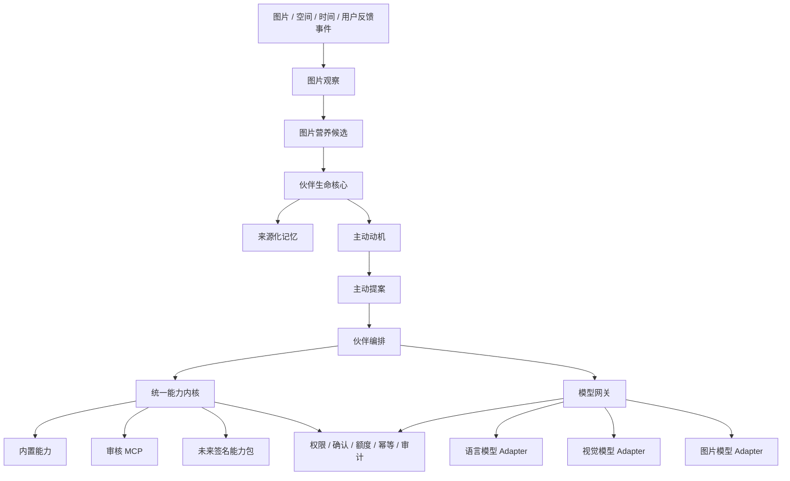

# LiPictureCloud 图像生命体平台三年总规划（2026—2029）

> 版本：1.0
>
> 基准日期：2026-08-14
>
> 规划周期：2026-08 至 2029-08
>
> 文档用途：对外介绍、团队对齐、阶段立项和路线评审
>
> 文档性质：滚动规划。未来 90 天是执行承诺，半年目标是产品承诺，一至三年方向必须通过阶段数据再立项。

## 一页摘要

LiPictureCloud 已经具备图片、个人/团队空间、权限、协同编辑、AI 对话、MCP 生图、对象存储和生产部署能力。未来三年，项目重点会从图片管理转向图片再利用：让已经存入图库的内容继续产生故事、作品、互动和陪伴体验。

产品主线是一个由用户长期培养的**图像生命体 / 虚拟伙伴**：用户把有权使用的图片喂给伙伴，伙伴从中获得经验、性格变化、技能成长和带来源的记忆；随后，它可以和用户对话、提出创作建议，并使用受控能力把图片变成故事、表情、多图作品、小游戏素材或虚拟形象。伙伴会成长，也会主动，但任何主动行为都受用户设定、权限、频率、费用和隐私边界约束。

三年路线按产品依赖关系逐步推进：

```text
第一年：让伙伴活起来，并证明用户愿意长期培养
    ↓
第二年：让伙伴会创作、会主动、可配置，并形成平台收入
    ↓
第三年：让能力、玩法和世界可扩展，形成生态与长期壁垒
```

| 时间 | 阶段目标 | 用户最终能感受到什么 |
| --- | --- | --- |
| 第一年 | 图像伙伴 MVP 与图片炼金闭环 | 图片能喂养伙伴；伙伴会升级、讲故事、记住来源并完成首批创作 |
| 第二年 | 可配置伙伴与创作平台 | 用户能选择模型/MCP、编排玩法、使用桌宠，并通过平台额度持续创作 |
| 第三年 | 能力生态与图库世界 | 第三方能力可安全接入；图片可变成小游戏、虚拟形象和多人世界资产 |

一句话对外介绍：

> LiPictureCloud 正在把云图库升级为“图像生命平台”：你的图片不只被保存，还会成为虚拟伙伴的记忆、成长养料和创作原料。

## 1. 愿景、问题与价值

### 1.1 要解决的问题

传统图库解决的是存储、分类、检索和分享，但图片在上传后往往迅速沉底。生成式 AI 虽然能创作，却经常脱离用户自己的长期资产、关系和上下文。虚拟伙伴提供陪伴感，却容易变成没有真实积累的聊天皮肤。

LiPictureCloud 把三者连接起来：

- 图库提供有权属、有来源、可持续积累的图片资产；
- 伙伴把这些资产转化为成长、记忆、关系和主动性；
- AI 能力把图片进一步生产为故事、表情、融合图、玩法和新资产；
- 权限、成本、审计和用户控制保证“活起来”不等于失控。

### 1.2 三种核心用户价值

1. **新鲜感**：同一批图片每次都可能触发新的故事、作品、提案或玩法。
2. **成就感**：伙伴的等级、生命阶段、性格、关系和技能形成长期可见积累。
3. **陪伴感**：伙伴会用自己的口吻解释成长、记住有来源的经历，并在合适的时候主动出现。

### 1.3 北极星目标

北极星不是模型调用次数，也不是伙伴每天发多少消息，而是：

> 用户持续把自己的图片转化为被保留的成长记录、伙伴记忆和新作品。

长期核心指标是“每位持续活跃用户每月保留的图片衍生资产数”，并结合次月留存、创作保存率和主动提案负反馈率判断产品是否健康。

## 2. 当前基础：我们不是从零开始

截至 2026-08-14，项目已有以下基础：

### 2.1 已进入主线的能力

- 公共图库、个人空间、团队空间和成员权限；
- 图片上传、检索、审核、编辑、下载、批量处理和 COS 对象存储；
- WebSocket 实时协同、Redis 跨实例状态和分布式会话；
- AI 流式对话、MCP 工具调用、AI 生图结果回收；
- ShardingSphere 分片模式、Liquibase 数据迁移、Docker Compose 和 GitHub Actions；
- 每位用户一个伙伴的生命核心：生命经验、等级、生命阶段、五条性格轴、技能熟练度、成长档案、幂等喂养和防刷规则。

### 2.2 当前功能分支已完成、待合入主线的能力

- 经授权读取图片内容并调用 DashScope/Qwen 视觉模型；
- 视觉调用每日硬上限、失败白名单降级、实际 Provider/模型/置信度审计；
- 模型以结构化结果给出成长候选，确定性规则负责最终数值；
- 伙伴用第一人称小故事解释“为什么这张图片带来这些成长”；
- 成长素材和成长档案采用有限渲染与区块内滚动，避免页面无限扩张；
- 本地 Stub、真实 Provider 冒烟、后端集成、前端构建和浏览器流程验证。

### 2.3 尚未实现的关键能力

- 长期记忆、快情绪、关系状态和记忆纠正/删除；
- 伙伴站内对话与受控主动提案；
- 用户级模型/MCP 控制中心、BYOK 与加密凭据；
- 统一能力内核和现有 AI/MCP 工具迁移；
- 图片故事成品、表情、多图融合与创作血缘；
- 平台额度账本、订阅和支付；
- 桌宠、玩法配方、第三方能力包、小游戏、虚拟形象与图库世界。

当前已经证明“图片可以安全地变成伙伴成长”，但尚未证明“伙伴能带来长期留存与商业价值”。第一年的任务就是完成这项验证。

## 3. 不会轻易改变的产品原则

1. **伙伴是主产品，图片炼金是能力，图库世界是远期舞台。**
2. **模型负责理解、创作和提出候选；规则负责成长、权限、预算和最终状态。** 模型不能直接写等级、性格、关系、权限或额度。
3. **原图始终是用户资产。** 喂养不移动、不删除、不改名、不覆盖原图；新作品创建为新图片并保留创作血缘。
4. **用户授权优先于伙伴性格。** 好奇心可以提高主动机会，但不能突破安静时段、次数、渠道、费用和确认要求。
5. **所有成长和记忆可解释、可追溯。** 用户能看到来源图片、实际模型、规则版本和变化理由。
6. **用户可以随时安静、敲打、纠正、撤权和删除。** 陪伴感不能以失去控制为代价。
7. **能力按实际画像路由。** 文本、视觉理解、图片生成、Embedding、音视频分别判断；不因品牌名猜测能力。
8. **先做安全配方，再开放第三方代码。** 用户自定义从声明式组合开始，插件市场必须等签名、沙箱、审核、吊销和回滚成熟后再开放。
9. **BYOK 与平台额度明确分账。** 用户密钥失败后不偷偷消耗平台钱包，平台试用永远有硬上限。
10. **路线按证据推进。** 三年愿景稳定，具体模型、供应商、数值和平衡规则按真实数据更新。

## 4. 三年产品路线总览


## 5. 第一年：让伙伴真正活起来（2026-08—2027-08）

### 年度目标

完成“喂图 → 理解 → 成长 → 记忆 → 对话 → 主动提案 → 创作 → 保存回图库”的闭环，并通过小规模用户验证：伙伴是否让人愿意持续回来使用自己的图片。

### 第一季度：完成可信的伙伴基础（2026-08—2026-10）

**主要交付**

- 合入并发布真实视觉喂养基础；
- 完善成长故事气泡、成长档案和来源披露；
- 完成伙伴当前情绪、关系状态和属性解释页；
- 建立带来源、置信度、状态的记忆候选；
- 支持记忆确认、纠正、删除和图片撤权后的失效传播；
- 收紧生产 CORS、密钥管理、日志脱敏和真实浏览器验收；
- 建立首批埋点：唤醒、首次喂养、再次喂养、故事阅读、负反馈和模型成本。

**季度出口条件**

- 新用户能在 10 分钟内完成第一次可信喂养；
- 用户能看懂成长原因和图片来源；
- 重复请求不重复成长，撤权后不继续读取图片；
- 生产环境无明文 Token、原始模型响应或图片 Data URL 落库/入日志。

### 第二季度：站内陪伴与主动提案（2026-11—2027-01）

**主要交付**

- 伙伴站内聊天，以统一聊天气泡承载喂养故事和普通互动；
- 将稳定人格、当前情绪、关系状态和检索记忆组合成可解释上下文；
- 实现 `Observe → Propose → Execute` 三段式主动系统；
- 自主契约页面：主动开关、频率、安静时段、离线规则、允许能力和确认要求；
- 好奇性格只影响机会得分，短期好奇冲动独立衰减；
- “敲打”立即抑制当前主动，重复负反馈才缓慢改变长期倾向；
- 第一批低风险主动场景：每周影像回顾、纪念日提醒、相似图片故事建议。

**季度出口条件**

- 关闭主动功能后所有新提案立即停止；
- 离线默认最多每 72 小时排队一个站内提案，且可设为零；
- 伙伴不能因高好奇突破安静时段、次数、预算或权限；
- 主动提案的接受、忽略、敲打和关闭原因均可观测。

### 第三季度：模型与 MCP 控制中心（2027-02—2027-04）

**主要交付**

- 建立统一模型网关和模型能力画像；
- 提供语言/Agent、视觉理解、图片创作三个独立任务路由；
- 首个语言 Adapter 以 DeepSeek 为初始设计默认，现有 Qwen 视觉 Adapter 纳入统一网关；
- 首个图片创作 Adapter 以 `gpt-image-2` 为初始设计默认；
- 用户级模型连接、连接测试、启停、轮换和删除；
- BYOK 凭据进入独立加密存储，只显示尾号；
- MCP 仅开放平台审核的服务和工具白名单，支持逐项启停；
- 统一能力内核 `discover / invoke / observe`，逐步迁移现有本地工具和 MCP 工具；
- 使用记录展示任务、模型、费用来源、用量和安全错误，不展示敏感原文。

**模型目录原则**

GPT、Claude、Gemini、DeepSeek、Kimi、Qwen，以及 GPT Image、Google 图片模型、Kimi、Qwen Image 等均属于目标目录；只有官方能力得到确认、Adapter 实现且连接测试通过的具体模型才在界面点亮。供应商名称不是兼容性承诺。

### 第四季度：图片炼金 MVP 与小规模内测（2027-05—2027-08）

**主要交付**

- 图片生成短篇故事：先给大纲和草稿，用户确认后形成可保存作品；
- 自动提取可复用元素，生成表情草稿和聊天回怼候选；
- 多张授权图片融合为新图片，来源图不被覆盖；
- 创作血缘：来源图片、能力版本、模型、模板版本、费用和操作者；
- 异步生成、幂等、结果暂存、失败恢复和状态对账；
- 平台试用额度硬上限与用量可见性；
- 20—100 名受控种子用户内测，建立访谈、反馈和数据复盘节奏。

**第一年验收标准**

- 端到端闭环可用：图片喂养、记忆、对话、主动提案、首批创作和回存；
- 用户无需学习 Prompt 即可完成至少一种创作；
- 主动提案的接受率、忽略率、敲打率和关闭率可被持续分析；
- 能明确算出每位活跃用户的视觉、语言和图片生成成本；
- 出现稳定的再次喂图与作品保存行为后，才进入第二年规模化建设。

## 6. 第二年：从伙伴产品走向可配置创作平台（2027-08—2028-08）

### 年度目标

让不同用户培养出真正不同的伙伴和玩法；在不开放任意代码的前提下提供可扩展性，并建立可持续的成本与收入模型。

### 第五季度：玩法配方工坊（2027-08—2027-10）

- 用户通过 `WHEN + 最多 5 个 IF + 一个 THEN` 组合白名单能力；
- 提供旅行回顾、生日故事、每周表情、旧照重制等官方模板；
- 配方只能收紧权限、范围和费用，不能扩大图片或空间权限；
- 提供试运行、执行预览、费用报价、版本、停用和历史回放；
- 伙伴技能熟练度影响表达风格和建议质量，不绕过能力权限。

### 第六季度：桌宠与多端陪伴（2027-11—2028-01）

- 推出桌面端轻量伙伴壳，先支持状态展示、聊天、提醒和创作任务入口；
- 桌宠调用同一伙伴核心、记忆和能力内核，不复制一套人格；
- 增加移动端通知或 PWA 通知，每个渠道独立授权和独立频率预算；
- 支持伙伴外观阶段、动作和情绪表达；
- 建立跨端已读、去重、撤回和紧急静默。

### 第七季度：多模型与运营平台（2028-02—2028-04）

- 按用户需求和官方能力扩展语言、视觉和图片 Provider；
- 建立 Provider 健康度、能力/价格快照、路由解释和显式备用策略；
- 引入语义检索与多来源记忆，但保留来源、置信度和纠正能力；
- 建立运营控制台：模型成本、限流、内容安全、失败恢复、主动行为健康度；
- 对高成本能力增加报价、预留、结算和对账；
- 开展平衡实验，但任何实验都不能关闭权限、预算和反骚扰硬约束。

### 第八季度：商业化软启动（2028-05—2028-08）

- 免费层：基础图库、有限伙伴能力和硬上限试用额度；
- BYOK 层：用户承担供应商费用，平台提供安全路由、记忆、审计和玩法；
- 订阅层：按周期发放平台额度和高级伙伴/创作能力；
- 额度包：按需购买，和订阅额度分桶、分有效期结算；
- 支付只负责给额度账本发放或撤销额度，不进入 Agent 和模型路由；
- 上线成本预警、消费确认、账单明细、退款/补偿和客服对账流程。

**第二年验收标准**

- 玩法配方存在可复用、可留存的真实使用，而不是一次性尝鲜；
- 桌宠或移动渠道带来净留存提升，且没有显著提高打扰和关闭率；
- BYOK 与平台额度分账正确，余额并发下永不为负；
- 单位活跃用户成本、付费转化和毛利具备可持续改善趋势；
- 至少两类模型 Provider 通过统一合约测试，但不追求供应商数量。

## 7. 第三年：能力生态、虚拟形象与图库世界（2028-08—2029-08）

### 年度目标

把已验证的伙伴与创作能力开放成安全生态，让图片从个人资产进一步变成可组合的玩法、形象和多人世界内容。

### 第九季度：签名能力包与沙箱（2028-08—2028-10）

- 定义能力包清单、稳定 ID、版本、输入/输出 Schema、权限、费用和副作用；
- 提供签名、依赖锁、审核、网络出口白名单、资源限制、吊销和回滚；
- 第三方能力先进入审核沙箱，不能直接访问数据库、Token 或完整用户图库；
- 建立开发者测试工具、模拟主体、授权资源夹具和审计回执；
- 首批只邀请可信开发者，不立即开放无审核市场。

### 第十季度：图片元素小游戏与虚拟形象实验（2028-11—2029-01）

- 从授权图片中提取可复用的物体、人物轮廓、色彩和场景元素；
- 用受限模板构建卡片、拼图、找不同、收集和轻叙事小游戏；
- 研究多图动作支点、姿态和服饰元素到虚拟形象的生成管线；
- 先做可丢弃原型验证“是否好玩”，再决定是否建设完整动画资产系统；
- 所有提取物保留来源、用途和撤权传播，不把人脸识别结果当身份事实。

### 第十一季度：图库世界与多人共创（2029-02—2029-04）

- 用户可把经过确认的作品、伙伴形态和小游戏发布到主题空间；
- 团队空间支持共同培养、协作创作和角色化权限；
- 世界中的资产仍引用云图库权属和创作血缘，不复制出不可治理的孤岛；
- 引入探索、收藏、协作任务和受控分享；
- 伙伴之间的互动先以用户批准的异步事件实现，不默认互相自由调用工具。

### 第十二季度：生态与规模化决策（2029-05—2029-08）

- 根据三年数据选择主增长引擎：个人陪伴、创作生产力、桌宠或图库世界；
- 对有效方向做性能、成本、内容安全、数据治理和国际化建设；
- 若能力包生态成立，再开放开发者分成、能力市场和创作者收益；
- 若小游戏或虚拟形象未证明留存，则保留为能力而不升级成独立平台；
- 发布透明的数据导出、伙伴迁移、账号注销和生态治理规则。

**第三年验收标准**

- 至少一种外部能力能在沙箱中安全运行、即时吊销并完整审计；
- 至少一种“图片变玩法/形象”的体验产生持续复用，而不只是 Demo 传播；
- 多人发布不破坏图片权属、空间权限和撤权传播；
- 产品已经明确一条主增长引擎，其留存、成本与收入足以支持下一周期。

## 8. 六条持续建设线

三年路线按季度推进，但以下工作流贯穿全程：

| 建设线 | 第一年重点 | 第二年重点 | 第三年重点 |
| --- | --- | --- | --- |
| 伙伴生命 | 成长、情绪、关系、记忆、反馈 | 长期调教、外观阶段、跨端一致性 | 极端属性剧情与伙伴间事件 |
| 图片生产 | 视觉理解、故事、表情、多图创作 | 配方化、批量化、更多模型 | 元素小游戏、虚拟形象、世界资产 |
| AI 运行 | 单 Provider 到统一网关、BYOK | 多 Provider、路由、成本运营 | 第三方能力包与开发者平台 |
| 主动系统 | 站内、低频、可关闭提案 | 桌宠和多端通知 | 多场景事件与生态能力 |
| 信任治理 | 权限、来源、隐私、幂等、审计 | 额度、内容安全、对账 | 沙箱、签名、市场治理 |
| 工程质量 | 领域测试、浏览器 E2E、迁移 | 可观测性、容量和故障演练 | 多租户隔离、规模化与灾备 |

## 9. 目标架构演进



### 架构边界

- **图片上下文**拥有图片与空间资源事实；
- **伙伴上下文**拥有成长、情绪、关系、记忆和主动动机；
- **AI 运行上下文**拥有模型/MCP 连接、能力目录、路由、凭据引用和平台额度；
- **创作上下文**拥有生成任务、暂存结果和创作血缘；
- **投递上下文**拥有站内、桌宠和未来渠道的发送授权与回执。

跨上下文使用事件与明确 Interface，不让模型参数构造主体身份，也不宣称外部 Provider 与本地数据库之间存在 exactly-once。

## 10. 指标体系与阶段闸门

### 10.1 用户价值指标

- 伙伴唤醒到首次成功喂养的完成率与耗时；
- 首周再次喂图率、次周/次月留存；
- 故事、表情和融合任务的发起率、完成率和保存率；
- 用户查看、确认、纠正和删除记忆的行为；
- 被保存回图库的衍生资产数。

### 10.2 陪伴健康指标

- 主动提案展示、接受、忽略、敲打和关闭率；
- 连续未响应后的抑制是否生效；
- 用户主动发起互动与伙伴主动发起互动的比例；
- 因安静时段、预算、权限和频率被守门抑制的机会数。

### 10.3 成本与商业指标

- 每位活跃用户的视觉、语言、图片生成和存储成本；
- BYOK 使用比例、试用额度耗尽率和异常消耗率；
- 订阅转化、额度包复购、退款与对账差异；
- 每次被保留作品的平均模型成本，而非每次调用成本。

### 10.4 质量与安全闸门

- 严重越权、跨用户图片泄漏、明文凭据泄漏：必须为零；
- 付费调用无预留、余额为负、幂等失效：必须为零；
- 关键生命规则、额度账本和权限 Interface 保持高覆盖与属性测试；
- 真实用户路径必须有浏览器 E2E，Provider 必须有 Stub 合约测试；
- 新渠道、新 Provider 和新能力包均具备独立停止开关和回滚路径。

具体增长阈值在种子用户阶段建立基线后确定。没有留存证据，不因“功能已经写了很多”自动进入下一阶段。

## 11. 商业模式路线

商业化按成本责任从清晰到复杂逐步推进：

1. **免费基础层**：图库核心、伙伴基础体验、严格限额的模型试用。
2. **BYOK**：用户连接自己的模型账户；平台提供安全连接、伙伴记忆、路由、审计和玩法价值。
3. **订阅**：周期性平台额度、更多伙伴能力、创作质量档位和高级配方。
4. **额度包**：给高频图片生成等可变成本能力按需补充。
5. **生态分成**：第三方能力和创作者市场验证后再引入。

支付不是第一年核心任务。先证明持续使用和成本结构，再接支付，可以避免建设一个没有留存支撑的钱包系统。

## 12. 团队与资源建议

以下是并行推进时的参考配置，不是启动前置条件；个人开发可按相同顺序延长周期。

| 阶段 | 建议核心配置 | 重点能力 |
| --- | --- | --- |
| 第一年 | 3—5 人 | 产品/交互、Java 后端、Vue 前端、AI/数据工程，设计与测试可兼职 |
| 第二年 | 6—9 人 | 增加桌面端、平台工程、增长运营、安全和客服/对账 |
| 第三年 | 10—16 人 | 增加沙箱安全、开发者生态、内容治理、游戏/动画与商业化 |

资源投入顺序：安全与数据迁移 → 伙伴核心与用户体验 → 观测与成本 → Provider 数量 → 支付 → 生态。不要为了模型列表好看而提前承担多供应商维护成本。

## 13. 主要风险与应对

| 风险 | 典型表现 | 应对 |
| --- | --- | --- |
| 好玩但不留存 | 用户只喂一次图 | 先验证重复喂图、作品保存和长期成长，再扩展世界观 |
| 伙伴太吵 | 忽略、敲打和关闭率升高 | 默认关闭或保守频率；自主契约和硬上限优先于性格 |
| 模型成本失控 | 免费用户高频生成 | 日限额、报价/预留/结算、BYOK、缓存和分级模型 |
| 隐私与越权 | 私图被错误外发 | 主体+权限+授权资源二次校验，最小出站，来源审计 |
| 多模型兼容幻觉 | 改 base URL 后行为不一致 | 共享传输、独立 Adapter、能力画像和 Provider 合约测试 |
| 生态过早开放 | 恶意 MCP、SSRF、Token 泄漏 | 审核白名单 → 受限配方 → 签名沙箱，分三步开放 |
| 数值系统被刷 | 重复喂图或并发请求涨经验 | 幂等、重复收益递减、每日上限、乐观锁和版本化平衡 |
| 功能过多失焦 | 同时做桌宠、游戏和世界 | 每季度只有一个主闭环；未过出口条件不扩大范围 |
| 供应商变化 | 模型下线、涨价或能力改变 | 动态能力/价格快照、显式备用路由和可替换 Adapter |
| 单人开发压力 | 路线过长、维护面过大 | 保持模块小接口、功能开关、文档化决策和季度收口 |

## 14. 明确不做或暂缓的事情

- 第一年前半段不做支付、开放插件市场和外部 IM 主动推送；
- 未完成 SSRF 防护、网络出口限制和审核前，不允许用户填写任意 MCP URL；
- 不默认扫描整个私人图库，不用人脸推断身份、健康、政治、宗教或亲密关系；
- 不允许成长等级换取更多打扰权限或费用权限；
- 不把元数据分析或视觉降级宣传成“模型看懂了图片”；
- 不为了覆盖热门品牌而一次接入所有模型；
- 不在小游戏和虚拟形象原型证明留存前建设大型内容平台；
- 不让生成结果覆盖原图，不让来源删除后仍暴露敏感衍生内容。

## 15. 未来 90 天执行清单

这是整份三年规划中最具体、最接近执行承诺的一段：

1. 完成当前真实视觉喂养分支的评审、合并和发布准备；
2. 增加当前情绪、关系状态和来源化记忆的数据模型与最小页面；
3. 实现记忆确认、纠正、删除及图片撤权后的失效；
4. 把伙伴解释统一为聊天气泡，为后续站内对话保留同一展示语言；
5. 完成生产 CORS 白名单、凭据/日志人工审计和真实环境发布检查；
6. 建立伙伴关键漏斗、主动健康和 Provider 成本指标；
7. 为下一阶段“主动提案闭环”单独编写规格，不把主动调度直接塞进喂养服务。

### 执行状态（2026-08-14 更新）

1. ✅ 已合并（PR #1，`main` @ `11a6182`）。
2. ✅ 已完成：情绪五轴（衰减规则）、关系五轴、来源化记忆与最小页面；见
   [round-20 指南](../round-20-companion-mood-relationship-memory-guide.md)。
3. ✅ 已完成：确认/纠正/忽略/删除 + 列表惰性失效 + 转移端点守门。
4. ✅ 已完成：喂养故事/情绪摘要/记忆统一走 `CompanionMessageBubble`。
5. ✅ 代码部分完成：生产 CORS 白名单 fail-fast + 非开发 profile 禁 `*`；
   凭据/日志人工审计与发布检查见
   [发布检查清单](../reviews/2026-08-14-production-security-release-checklist.md)（待人工签字）。
6. ✅ 已完成：关键漏斗/主动健康/成本指标日志与口径见
   [指标口径](../metrics/companion-funnel-metrics.md)。
7. ✅ 已完成：规格见
   [主动提案闭环设计](../superpowers/specs/2026-08-14-companion-proactive-proposal-design.md)；
   第一版实现（自主契约 + 每周回顾/纪念日/相似图片三机会源 + 敲打）见
   [round-21 指南](../round-21-companion-chat-proposal-guide.md)。

> 后续进展：站内对话（可解释上下文 + 双档策略）与主动提案第一版已随 Q2 第一批交付；
> Q3「模型与 MCP 控制中心」与 Q4「图片炼金 MVP」的规格已先行完成，待季度评审立项。

## 16. 对外沟通版本

### 30 秒版本

LiPictureCloud 原本是一套支持个人和团队空间、权限协作与 AI 生图的云图库。我们正在把它升级为图像生命平台：用户可以用自己的图片培养一个会成长、会记忆、会创作的虚拟伙伴。第一年完成伙伴和图片创作闭环，第二年开放模型、MCP、桌宠和玩法配置，第三年再进入小游戏、虚拟形象和图库世界。整个过程中，原图权属、用户授权、费用上限和隐私审计始终由平台规则控制。

### 为什么值得做

- 伙伴的成长来自用户自己的长期图片资产，因此不同用户会得到不同的经历和反馈；
- 每次 AI 创作都进入伙伴关系、技能记录和资产血缘，而不是一次用完即走；
- 图片上传后的生命周期被延长，旧图片也能重新参与互动和创作；
- 收费可以按实际成本逐步展开：免费体验、BYOK、订阅额度、创作消费，最后才是生态分成。

### 三年结束时希望看到的产品

用户打开的不再只是一个文件夹，而是一个由自己图片养成的数字生命空间：伙伴认识这些经历的来源，能用合适的模型和工具帮助用户创作，在被允许的时候主动陪伴；图片还能继续变成故事、表情、游戏、形象和多人世界中的资产。用户随时可以解释、纠正、暂停或删除这一切。

## 17. 规划治理

- 每月检查执行风险、成本和安全问题；
- 每季度复盘用户指标并决定下一季度是否扩展范围；
- 每半年更新一次本三年规划，保留决策变化记录；
- 具体阶段遵循“调研/规格 → 实施计划 → 开发 → 自动验证 → 人工验收 → 发布复盘”；
- 新模型、新 MCP、新渠道和新能力必须有 Owner、费用预算、权限说明、停止开关和退出方案；
- 本文档描述方向，具体实现以对应阶段的设计、实施计划和验收文档为准。

## 相关文档

- [图像生命体与可扩展 AI 平台设计](../superpowers/specs/2026-08-11-image-life-companion-platform-design.md)
- [伙伴图片观察基础层设计](../superpowers/specs/2026-08-13-companion-vision-foundation-design.md)
- [伙伴生命核心与演示喂养指南](../round-19-companion-life-core-guide.md)
- [多模型 Provider 兼容性与 Adapter 设计调研](../research/2026-08-11-model-provider-compatibility.md)
- [AstrBot 对图像生命体的设计启示](../research/2026-08-11-astrbot-patterns.md)
- [代码复审与人工验收手册](../reviews/2026-08-13-companion-life-core-review-and-manual-checklist.md)
