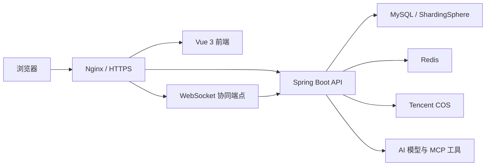

# Recruiter-Focused README Implementation Plan

> **For agentic workers:** REQUIRED SUB-SKILL: Use superpowers:subagent-driven-development (recommended) or superpowers:executing-plans to implement this plan task-by-task. Steps use checkbox (`- [ ]`) syntax for tracking.

**Goal:** Create a Chinese, recruiter-focused root README that explains LiPictureCloud's business value, verifiable technical depth, architecture, engineering quality, and safe ways to run the project.

**Architecture:** Keep the root `README.md` as a fast-scanning project entry point. It will summarize the verified implementation and link to the existing beginner-oriented guides for details, without duplicating deployment manuals or exposing secrets.

**Tech Stack:** Markdown, Mermaid, Java 21, Spring Boot, MyBatis-Plus, Sa-Token, Redis, WebSocket, ShardingSphere, Spring AI, Vue 3, Docker Compose, Nginx

## Global Constraints

- Write primarily in Chinese; retain English framework, protocol, and infrastructure names.
- Optimize the first screen for domestic Java backend recruiters and interviewers.
- Show `https://lipicturecloud.com` but do not publish a public test account.
- Include only capabilities supported by current code, tests, configuration, or repository documentation.
- Do not publish passwords, tokens, cloud credentials, server login details, or production `.env` values.
- Do not invent benchmark numbers, coverage percentages, concurrency claims, or efficiency gains.
- Distinguish completed features from future plans such as DDD migration.
- Keep detailed operations in `docs/`; the root README contains concise commands and links.

---

## File Map

- Create `README.md`: recruiter-facing project entry point, architecture overview, verified highlights, quick start, and document index.
- Reference `pom.xml`: authoritative backend dependency and Java version source.
- Reference `li-picture-cloud-frontend/package.json`: authoritative frontend dependency and Node version source.
- Reference `compose.yaml`: authoritative production service names and startup command source.
- Reference `docs/round-15-team-space-guide.md`: team-space and collaboration details.
- Reference `docs/round-16-password-ai-security-guide.md`: password and AI security details.
- Reference `docs/round-17-user-seed-guide.md`: seed data instructions.
- Reference `docs/round-18-docker-deployment-guide.md`: OpenCloudOS production deployment details.
- Reference `docs/未决问题.md`: known unresolved items.

### Task 1: Write the recruiter-facing README

**Files:**
- Create: `README.md`
- Read: `pom.xml`
- Read: `li-picture-cloud-frontend/package.json`
- Read: `compose.yaml`
- Read: `docs/round-15-team-space-guide.md`
- Read: `docs/round-16-password-ai-security-guide.md`
- Read: `docs/round-17-user-seed-guide.md`
- Read: `docs/round-18-docker-deployment-guide.md`
- Read: `docs/未决问题.md`

**Interfaces:**
- Consumes: repository code and documentation as the only source of truth.
- Produces: a root `README.md` whose relative links and commands can be checked mechanically.

- [ ] **Step 1: Verify the facts used in the README**

Run:

```powershell
rg -n "<java.version>|spring-boot-starter-websocket|shardingsphere-jdbc|spring-session-data-redis|sa-token|spring-ai" pom.xml
rg -n '"node"|"vue"|"vite"|"test"|"build"' li-picture-cloud-frontend/package.json
rg -n "^  (mysql|redis|backend|web):|healthcheck:|mem_limit:" compose.yaml
rg -n "WebSocket|权限|协同|BCrypt|MCP|Docker|OpenCloudOS" docs/*.md
```

Expected: every technology and engineering claim planned for the README has at least one repository match.

- [ ] **Step 2: Create the README first screen and project overview**

Create `README.md` with:

```markdown
# LiPictureCloud 智能云图库

> 面向个人与团队的智能图片资产管理平台，覆盖图片上传、检索、审核、空间权限、实时协同编辑、AI 生图和图库分析，并完成 Docker 化生产部署。

[线上体验](https://lipicturecloud.com)（不提供公共测试账号）

## 项目亮点

- 个人空间、团队空间与公共图库组成完整的图片资产管理模型。
- 基于角色和权限码统一约束 HTTP 接口与 WebSocket 协同操作。
- 团队成员可实时观察旋转、缩放等编辑动作，查看者只读、编辑者可提交。
- AI 对话与生图工具按当前登录用户隔离，生成结果保存到正确的个人空间。
- 使用 Redis、ShardingSphere、COS、Docker Compose 和 Nginx 完成数据、存储与部署治理。
```

Follow with a short “项目简介” explaining public gallery, private space, team space, administrator review, and analysis without enumerating controllers.

- [ ] **Step 3: Add verified business capabilities and technology stack**

Add grouped capability lists for:

```text
图片管理：文件/URL 上传、批量抓取、检索、审核、下载、编辑
空间体系：个人空间、团队空间、成员角色、容量限制
实时协同：WebSocket 鉴权、房间状态、旋转和缩放事件
AI 能力：流式对话、意图识别、MCP 生图、用户归属隔离
数据分析：容量、数量、分类、标签、大小和上传趋势
```

Add a technology table grouped as:

```text
Backend: Java 21, Spring Boot, MyBatis-Plus, Sa-Token, Spring AOP
Data: MySQL, Redis, Caffeine, ShardingSphere
AI/Storage: Spring AI Alibaba, MCP, DashScope/Qianfan integration, Tencent COS
Frontend: Vue 3, Pinia, Vue Router, ECharts, Vite
Engineering: Maven Wrapper, Node Test, GitHub Actions, Docker Compose, Nginx
```

Do not add version numbers unless they are explicitly pinned in `pom.xml` or `package.json`.

- [ ] **Step 4: Add the Mermaid architecture diagram**

Use this component-level diagram:



Add one sentence for each infrastructure responsibility so the diagram is useful without reading implementation code.

- [ ] **Step 5: Explain interview-ready technical challenges**

Write compact “问题—设计—结果” paragraphs for:

1. Team-space authorization shared by REST and WebSocket boundaries.
2. Read-only collaboration viewers receiving authoritative events without edit permission.
3. Redis responsibilities for distributed Session and collaboration state.
4. User-scoped AI tool callbacks preventing cross-user generated-image ownership.
5. Static/dynamic sharding strategies with a disabled-sharding profile.
6. Externalized production configuration, health checks, memory limits, and gateway proxying.

Use qualitative outcomes such as “避免跨用户上下文污染” and “使权限规则在不同传输协议下保持一致”. Do not state numeric performance improvements.

- [ ] **Step 6: Add safe quick-start commands**

Document prerequisites:

```text
JDK 21
Node.js 22
MySQL 8
Redis 7
```

Backend commands:

```powershell
./mvnw spring-boot:run
```

Frontend commands:

```powershell
cd li-picture-cloud-frontend
npm ci
npm run dev
```

Docker commands:

```bash
cp .env.example .env
docker compose --env-file .env up -d --build
```

State that `.env` must be populated with the user's own database, Redis, COS, and AI credentials and must never be committed.

- [ ] **Step 7: Add project structure, documentation index, and boundaries**

Add a compact tree for:

```text
src/main/java                         Spring Boot backend
src/main/resources                    profiles and sharding configuration
li-picture-cloud-frontend             Vue frontend
deploy/nginx                           gateway templates
sql                                    schema and seed templates
docs                                   governance and deployment guides
compose.yaml                           production container orchestration
```

Link all five documents in the File Map. Add an “已知边界与后续规划” section that says external services require valid credentials, the public demo has no shared account, and DDD migration is a future architecture direction rather than a completed feature.

- [ ] **Step 8: Review the README for recruiter scanability**

Check manually that:

```text
The title, one-line positioning, live URL, and five highlights appear before detailed setup.
No section reads like a raw endpoint inventory.
The six technical challenges are supported by repository evidence.
The README can be skimmed through headings in under three minutes.
```

Expected: the opening explains project value before implementation detail.

### Task 2: Validate and publish the README

**Files:**
- Modify if validation finds defects: `README.md`
- Test: `README.md` links, Mermaid fence, commands, and secret scan

**Interfaces:**
- Consumes: `README.md` produced by Task 1.
- Produces: a validated README committed independently from its design and implementation plan.

- [ ] **Step 1: Validate every local Markdown link**

Run:

```powershell
$readme = Get-Content -Raw README.md
$links = [regex]::Matches($readme, '\[[^\]]+\]\((?!https?://|#)([^)]+)\)')
$missing = foreach ($link in $links) {
  $path = [uri]::UnescapeDataString($link.Groups[1].Value)
  if (-not (Test-Path -LiteralPath $path)) { $path }
}
if ($missing) { $missing; exit 1 }
```

Expected: exit code 0 and no missing paths.

- [ ] **Step 2: Validate structure and Mermaid fences**

Run:

```powershell
rg -n "^# LiPictureCloud|^## 项目亮点|^## 技术架构|^## 核心技术难点|^## 快速开始|^## 文档导航|```mermaid" README.md
$fences = (Select-String -Path README.md -Pattern '^```').Count
if ($fences % 2 -ne 0) { throw 'README contains an unclosed code fence' }
```

Expected: every required section is found and code-fence count is even.

- [ ] **Step 3: Scan for secrets and unsupported claims**

Run:

```powershell
rg -n "(SECRET_KEY\s*[:=]\s*[^<]|PASSWORD\s*[:=]\s*[^<]|1198894955|82\.156\.66\.244|QPS|提升[0-9]+%|覆盖率[0-9]+%)" README.md
```

Expected: no output. Generic environment-variable names without assigned values are allowed.

- [ ] **Step 4: Check formatting and working-tree scope**

Run:

```powershell
git diff --check -- README.md
git status --short
```

Expected: `README.md` has no whitespace errors; unrelated user changes remain unstaged and untouched.

- [ ] **Step 5: Commit and push the README**

Run:

```powershell
git add -- README.md
git commit -m "docs: add recruiter-focused project readme"
git push origin main
```

Expected: the commit contains only `README.md`, and `main` is pushed successfully.

