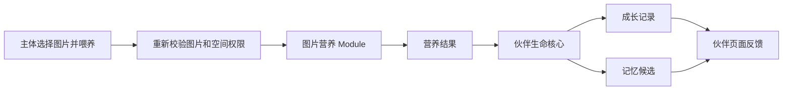
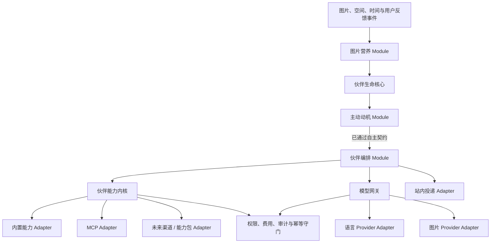

# 图像生命体与可扩展 AI 平台设计

## 1. 文档状态

- 设计日期：2026-08-11
- 状态：产品方向与总体设计已获确认
- 性质：三年方向下的项目级设计，不等同于一次性实施计划
- 下一步：本设计通过书面审阅后，只为第一个可交付纵向切片编写实施计划

本设计建立在现有 LiPictureCloud 的图片、空间、权限、AI 对话和 MCP 生图能力之上。它不要求立即重写项目，也不在当前阶段接入支付；它先规定长期不应反复变化的领域语言、模块 Seam、安全不变量和阶段边界。

### 1.1 现有基线与发布前置条件

当前项目的后端和前端构建均能通过，但这条产品路线会放大几个已经存在的工程不足：

- AI 调用仍由 `PicCloudApp` 等类拼装本地与 MCP 工具，并依赖 `UserContextHolder` 传递用户，尚无统一能力 Interface。
- 模型和 MCP 主要是平台级配置，没有用户级连接、加密凭据、能力画像、费用来源和额度账本。
- 最近一次 JaCoCo 验证的整体行覆盖率约为 21.8%、分支覆盖率约为 12.1%，图片、空间和分析等核心 Service 的直接覆盖很低。
- 前端现有测试包含较多源码契约检查，尚缺覆盖真实喂养、主动提案和模型配置流程的浏览器 E2E。
- 当前生产 CORS 使用 `allowedOriginPatterns("*")` 并允许凭据；在保存用户 Token 或开放主动能力前必须改为明确来源白名单。
- 仓库尚未使用 Flyway 或 Liquibase；新增伙伴、记忆、连接和额度表之前必须建立可回滚的数据库迁移机制。

因此，任何对外开放的真实 Provider 版本都必须先满足：生产 CORS 白名单、独立秘密存储、数据库迁移、关键领域测试和真实浏览器 E2E。第一条本地纵向切片可以在这些生产门槛完成前开发，但不能以此状态发布给真实用户。

调研依据：

- [AstrBot 可借鉴模式与边界](../../research/2026-08-11-astrbot-patterns.md)
- [多模型 Provider 兼容性与 Adapter 设计](../../research/2026-08-11-model-provider-compatibility.md)
- [OpenAI GPT Image 2 模型说明](https://developers.openai.com/api/docs/models/gpt-image-2)
- [OpenAI 图片生成与编辑指南](https://developers.openai.com/api/docs/guides/image-generation)

## 2. 产品判断

LiPictureCloud 的长期方向不是继续给传统图库堆叠更多按钮，而是让图片成为可被消耗、分析、组合、转化并产生新资产的生产资料。

用户上传或选择图片后，应当同时获得三种反馈：

1. **新鲜感**：同一组图片可以变成故事、表情、融合图、伙伴记忆和后续玩法，而不只是再次被浏览。
2. **成就感**：图片喂养推动伙伴升级、形成独特人格并学习技能，长期使用留下可见积累。
3. **陪伴感**：伙伴会记住有来源的偏好、在受控范围内主动提出想法，并根据用户反馈逐渐改变。

主路线采用“图像生命体 / 虚拟伙伴”。图片炼金是首批能力，图库世界是远期舞台。三者不是并列建设的三套产品：

```text
图像生命体（长期主干）
    ├─ 图片炼金（首批可玩能力）
    └─ 图库世界（成熟后的世界观与多人空间）
```

## 3. 成功标准与护栏指标

### 3.1 用户价值指标

- 新用户能在 10 分钟内完成“唤醒伙伴 → 喂一张授权图片 → 看到成长反馈”。
- 用户能解释伙伴为什么获得某段记忆、经验或人格变化。
- 用户能在不学习 Prompt 的情况下完成一次故事草稿或多图创作任务。
- 用户能随时停止主动行为、降低打扰或删除由图片产生的记忆。
- 连续使用的价值来自成长和作品积累，而不是依赖无限消息推送。

### 3.2 产品健康指标

重点观察首周再次喂图率、首次创作完成率、主动提案接受率、主动提案忽略率、“敲打”率、关闭主动功能率、每位活跃用户的模型成本和生成成功率。

主动消息数量、模型调用次数和总 Token 消耗不作为正向核心指标。高“敲打”率、频繁关闭主动功能或成本快速增长都视为产品退化信号。

## 4. 阶段范围

### 4.1 半年 MVP 必须完成

- 每位用户拥有一个专属伙伴。
- 伙伴拥有等级、经验、生命阶段、慢性格、快情绪、关系状态、技能熟练度和自主契约。
- 用户主动选择授权图片进行喂养，并获得经验、人格微调、技能成长和有来源的记忆候选。
- 提供伙伴主页、成长记录、属性解释、反馈与“敲打 / 安静”入口。
- 提供站内对话和少量、可关闭、受好奇心与预算限制的主动提案。
- 首批玩法包含图片故事草稿、表情草稿和多图创作任务。
- 提供独立的语言模型与图片模型配置槽；设计默认分别为 DeepSeek 与 `gpt-image-2`。
- 提供独立的视觉理解任务路由；半年 MVP 至少接入一个经验证的 `imageInput=true` 模型，不能让 DeepSeek 或图片生成模型冒充视觉分析能力。
- 支持用户自带密钥（BYOK）和平台硬上限试用额度。
- 建立统一伙伴能力内核，使内置能力、MCP 和未来渠道通过同一套权限、费用与审计规则执行。
- MVP 结束前具备真实 DeepSeek 文本 Adapter 和 GPT Image 2 图片 Adapter；第一条实施切片允许先使用假 Adapter 验证领域闭环。

### 4.2 半年 MVP 明确不做

- 支付、订阅购买和完整商业化。
- 任意 MCP URL、用户脚本、任意服务器代码或第三方插件市场。
- 桌面宠物、微信、QQ 或其他 IM 渠道的外部主动推送。
- 多人伙伴世界、完整小游戏平台和虚拟形象经济。
- 极端属性的完整特殊剧情引擎；MVP 只保留可审计的状态事件钩子。
- 一次接完全部热门模型。

### 4.3 一年至三年方向

- **约一年**：玩法配方工坊、更多模型与审核 MCP、可修正记忆、桌宠与移动通知、更多图片炼金能力。
- **一至三年**：签名能力包与沙箱、插件生态、极端状态剧情、图片元素小游戏、由图片动作支点生成的虚拟形象、图库世界、订阅与购买额度。

这些是被明确推迟的能力，不是 MVP 的隐藏验收项。

## 5. 领域语言

完整词汇表记录在：

- [伙伴上下文](../../../src/main/java/com/li/lipicturecloud/domain/companion/CONTEXT.md)
- [AI 运行上下文](../../../src/main/java/com/li/lipicturecloud/domain/airuntime/CONTEXT.md)
- [图片上下文](../../../src/main/java/com/li/lipicturecloud/domain/picture/CONTEXT.md)

关键区分如下：

- **生命经验与等级**回答“成长了多少”，只增不减，不直接提高打扰概率。
- **性格轴**回答“它逐渐成为什么样”，变化缓慢且有两端取舍。
- **情绪**回答“它现在处于什么状态”，会随时间和事件衰减。
- **技能熟练度**回答“它擅长做什么”，由使用、练习和组合任务成长。
- **好奇冲动**是一次机会产生的短期行动动机，不等同于长期好奇性格。
- **自主契约**是用户直接设置的安全边界，不属于伙伴人格，任何成长都不能越过它。
- **主动提案**是伙伴请求用户注意或批准的受控行为，不等同于已获得执行权限。
- **模型连接**描述如何连接外部模型；**模型能力画像**描述某个具体模型实际上能做什么。品牌名不能代替能力判断。

## 6. 伙伴成长模型

### 6.1 五层状态

| 层 | 内容 | 变化速度 | 用户能否直接修改 |
| --- | --- | --- | --- |
| 性格轴 | 好奇↔谨慎、热情↔克制、淘气↔沉稳、共情↔理性、创造↔秩序 | 慢 | 只能通过反馈引导，不能直接写值 |
| 当前情绪 | 精力、愉悦、孤独、灵感、烦躁 | 快 | 可通过互动影响，不直接写值 |
| 关系状态 | 熟悉度、信任、亲密度、默契、近期反馈 | 中 | 由真实互动产生 |
| 技能熟练度 | 图片融合、表情制作、故事创作、图库搜索等 | 中 | 通过使用、练习和里程碑成长 |
| 自主契约 | 主动上限、安静时段、离线规则、允许能力、确认要求 | 立即 | 用户可直接设置 |

性格轴内部统一为 `[-100, 100]` 的双极值，`0` 为中性；情绪和关系值使用 `[0, 100]`；所有变更必须经过版本化平衡规则并夹紧到合法区间。界面展示自然语言和相对变化，不鼓励用户把伙伴当作数值面板刷满。

### 6.2 等级、经验与生命阶段

- 生命经验非负且单调增加，等级由累计经验确定。
- 每级所需经验递增，具体曲线属于版本化平衡配置，不写死在领域对象或 Prompt 中。
- 经验解锁外观阶段、能力槽位、剧情章节入口和玩法入口，但不扩大权限、不增加费用上限，也不直接提高主动频率。
- MVP 使用“光点 → 幼体 → 伙伴”三个可见生命阶段；“共生体”和“世界守护者”保留给后续路线。
- 技能使用独立熟练经验，不能用总等级替代。

平衡配置必须声明版本。成长记录保存计算时的配置版本，使规则调整后仍能解释历史结果。

### 6.3 极端状态

性格轴进入 `[-100,-90]` 或 `[90,100]` 时可产生一次 `TraitExtremeEntered` 领域事件；退出到绝对值小于 `85` 后才允许再次进入，避免阈值附近重复触发。

MVP 只记录事件和展示轻量提示，不自动执行特殊操作，不生成完整剧情，也不扩大权限。特殊行为和故事内容属于后续独立设计。

## 7. 喂图与成长数据流

### 7.1 主流程



图片营养结果包含：

- 基础经验与新颖度奖励；
- 置信度受控的人格微调；
- 与内容和任务有关的技能经验；
- 带来源图片 ID、置信度和生成理由的记忆候选；
- 可供故事、表情或融合任务使用的结构化视觉线索。

外部视觉理解模型只提供观察和候选解释。若没有可用的 `imageInput=true` 连接，系统只能使用尺寸、时间、格式、主色等本地元数据生成受限营养，并在界面明确标记“未进行内容理解”。等级、经验、人格数值、技能数值和关系值由确定性规则计算，模型不能直接写入。

### 7.2 防刷与幂等

- 一次喂养请求必须具有幂等键；相同请求重复提交只返回原结果。
- 首次喂入一张图片可获得完整营养；同一伙伴重复喂入同一图片只给极少量互动反馈，不重复产生完整人格和技能变化。
- 新颖度、用户亲自补充的描述、完成配方和持续互动可以提供额外经验。
- 每日喂图经验、单张图片影响量和单次人格偏移都有硬上限。
- 批量喂图按图片逐项校验权限与去重，不因其中一张失败而重复处理已成功项。

数值常量由可模拟、可回滚的平衡配置提供。设计不把一组尚未经过真实用户数据验证的数值写成永久产品承诺，但以下不变量不可配置关闭：经验不减、单次性格变化很小、重复图片收益显著递减、每日收益有上限。

### 7.3 图片删除与记忆

MVP 中，删除来源图片会使仅由该图片支持的派生记忆失效；由多个来源支持的记忆移除该来源后重新计算置信度。成长记录保留不含原图内容的审计事实，但界面不再展示已删除图片的缩略图、描述或敏感特征。

后续可以设计“删除图片但明确保留已确认记忆”，MVP 不提供该例外。

## 8. 主动行为与自主契约

### 8.1 Observe → Propose → Execute

主动系统分三档：

1. **观察**：发现新图片、纪念日、沉默、创作机会或计划到期。观察不打扰用户，也不默认调用昂贵模型。
2. **提议**：伙伴形成“我想把这些旅行照做成故事”的主动提案。默认提案只使用模板和已有结构化信息；只有用户在自主契约中预授权了费用来源与每日上限时，才可附带低成本模型草稿。提案不代表获准执行高风险动作。
3. **执行**：只自动执行自主契约预授权的低风险动作。发布、删除、改权限、外部发送和付费生成始终需要明确确认。

### 8.2 好奇心如何影响主动概率

不采用固定随机概率插话。主动 Module 先计算：

```text
行动得分 = 事件价值 × 好奇因子 × 情绪因子 × 关系因子 × 响应因子
```

得分通过场景阈值后才产生提案，并始终再经过安静时段、冷却、每日次数、费用预算、未响应衰减、权限和自主契约守门。长期“好奇↔谨慎”性格影响好奇因子，短期好奇冲动影响当前事件，因此好奇越高，长期观察到的主动概率越高，但永远受硬上限限制。

同分场景可加入可复现的小幅随机扰动以保留新鲜感；测试使用固定种子，随机数不能绕过任何守门条件。

### 8.3 在线、离开页面与离线

- 在线活跃时，伙伴可以在每日上限内即时展示站内提案。
- 用户离开页面后，伙伴仍可推进时间、情绪和低成本观察，但不进行外部推送。
- 离线期间默认最多每 72 小时排队一个站内提案；用户返回后再展示。用户可将该值设为零。
- 离线状态不自动执行付费图片生成，也不因“更好奇”突破费用和次数上限。
- 一年阶段接入桌宠或 IM 时，每个渠道必须重新取得发送授权并拥有独立频率预算。

### 8.4 “敲打”与长期调教

一次“敲打”立即清空当前好奇冲动、取消尚未发送的同类提案并进入短期谨慎冷却。单次反馈不重置长期性格。

重复的同类负反馈才通过缓慢、可解释的成长记录使性格向谨慎或克制方向微调。专属定制页允许用户查看所有属性，并通过“更大胆 / 更安静”等调教意图影响未来变化；只有自主契约中的频率、时段、渠道、能力和确认规则可以被直接设置。

## 9. 系统架构

### 9.1 总体数据流



确定性 Module 维护成长、权限和预算；模型负责理解、创作和提出候选。模型输出永远不是授权、费用批准或领域状态变更命令。

### 9.2 深 Module 与 Interface

| Module | 小 Interface | 隐藏的 Implementation |
| --- | --- | --- |
| 伙伴生命核心 | `feed`、`applyFeedback`、`advanceTime`、`snapshot` | 等级、人格、情绪、关系、技能、极端状态、版本和成长记录 |
| 主动动机 | `evaluateOpportunity` | 得分、冷却、未响应衰减、在线/离线规则、每日预算和自主契约 |
| 伙伴能力内核 | `discover`、`invoke`、`observe` | 权限、授权资源、风险、确认、费用、幂等、异步任务、审计和 MCP 差异 |
| 模型网关 | `complete`、`analyzeImage`、`generateOrEditImage`、`capabilities` | Provider 协议、流式处理、能力匹配、模型路由、用量归一、重试和错误映射 |
| 额度账本 | `quote`、`reserve`、`settle`、`release` | 额度桶、并发扣减、到期顺序、对账和补偿 |

这些是概念 Interface，不要求照抄为同名 Java 类。实施计划应保持外部 Surface 小，把数据库、Redis、Spring AI、MCP、HTTP 和供应商 SDK 留在 Seam 后。

### 9.3 伙伴能力调用不变量

1. `discover` 只返回当前主体可见、已启用且适合当前渠道的能力；目录可见不代表拥有某张图片的对象权限。
2. `invoke` 再次按“主体 + 权限 + 授权资源”校验，并在有副作用或收费时先持久化审计意图与费用预留。
3. `observe` 用于查询异步生图或外部任务；外部结果未知时返回 `OUTCOME_UNKNOWN`，不能盲目重试并声称失败。

能力描述至少包含稳定 ID、版本、输入/输出 Schema、权限、风险、副作用、费用和同步/异步模式。未知 MCP 工具不能因远端自报就直接进入模型目录。

## 10. 可扩展性

### 10.1 三层路线

- **现在：最小能力运行内核。** 开发者把图库搜索、喂图、故事、表情和图片创作实现为原子能力。
- **约一年：用户玩法配方。** 用户使用 `WHEN + 最多 5 个 IF + 一个 THEN` 组合白名单能力；不允许脚本、SQL、SpEL、任意 URL 或无界循环。
- **远期：能力包生态。** 第三方包需要签名、版本、依赖锁、迁移、沙箱、网络出口限制、审核、吊销和回滚。

用户配方只能收紧能力的权限、费用和范围，不能扩大主体对图片、空间或外部渠道的权限。组合能力的权限取并集、风险取最高值、费用取保守上界。

### 10.2 现有 AI 代码的迁移位置

- `ToolRegistration` 变成内置能力 Adapter，不再决定全局工具集合。
- `RefreshableMcpToolProvider` 变成 MCP 目录与调用 Adapter；连接刷新和异步轮询留在能力内核后。
- `PicCloudApp`、`PicAgent` 和 `ToolCallAgent` 只消费当前主体可用的能力目录，不再各自合并本地与 MCP 工具。
- `UserContextHolder` 在迁移期只能封闭在旧工具 Adapter 内；新 Interface 显式接收认证 Module 签发的主体上下文，模型参数不能构造或覆盖主体。

## 11. 模型、图片模型与 MCP 控制中心

### 11.1 双模型路由

用户界面保留两个最常用的默认槽位，视觉理解等任务在高级路由中配置：

| 路由 | 初始设计默认 | 首期定位 |
| --- | --- | --- |
| 语言 / Agent | DeepSeek | 文本、推理、工具调用；不承担图片输入或图片生成 |
| 图片创作 | `gpt-image-2` | 文生图、图片编辑、多图参考融合 |
| 视觉理解 | 由部署或用户选择一个 `imageInput=true` 连接 | 喂图内容理解、结构化视觉线索；不默认生成图片 |

Embedding、音频和视频同样属于任务路由，但不进入半年 MVP 的主要默认槽位。语言 Provider、视觉理解 Provider 和图片创作 Provider 可以来自同一家供应商，也可以完全不同；路由只看经验证的能力画像。

用户可以分别覆盖两个默认值。一次任务的路由顺序为：

1. 按任务能力要求过滤模型；
2. 使用本次任务的显式选择；
3. 使用伙伴级覆盖；
4. 使用用户默认连接；
5. 经过平台隐私、预算、健康度和可用性守门。

没有满足能力和费用条件的模型时明确失败，不静默丢弃图片、不改用更贵模型，也不改变费用来源。

### 11.2 图片模型能力画像

每个具体图片模型独立声明并验证：文生图、单图编辑、多图融合、局部重绘、最大参考图数、输入格式、输出尺寸、质量、透明背景、同步/异步、内容安全和费用估算。

OpenAI、Google Banana 系列、Qwen Image、Kimi 及其他供应商是目标目录，不是统一能力承诺。只有官方能力被确认、Adapter 实现且连接测试通过后，功能才在界面点亮。模型 ID、价格和能力快照需要动态维护；未知能力默认 `false`。

### 11.3 DeepSeek 首个预留连接

第一阶段配置契约：

```yaml
providerId: deepseek
enabled: false
protocol: OPENAI_CHAT_COMPLETIONS
apiKey: <加密凭据引用>
baseUrl: https://api.deepseek.com
model: <显式模型 ID>
```

DeepSeek 可共享 OpenAI Chat Completions 的底层传输，但必须拥有独立 Adapter，处理推理状态回放、工具差异、Beta 特性和错误映射。不能用一个可改 `baseUrl` 的万能 OpenAI Adapter 冒充完整兼容。

### 11.4 GPT Image 2 初始默认

`gpt-image-2` 通过独立 OpenAI 图片 Adapter 接入。单次生成或编辑优先走 Image API；需要多轮可编辑对话时再由支持的语言模型通过 Responses 图片工具编排。

默认连接不存在、密钥无效、组织无权限或额度不足时，图片创作入口显示具体配置指引，不自动借用平台密钥。

### 11.5 个人 MCP 配置

控制中心至少包含模型服务、MCP 连接、任务路由、预算与额度、数据与隐私、使用记录六部分。

MVP 只允许平台审核的 MCP 服务与工具白名单，用户保存自己的凭据引用并逐项启停工具。任意 URL 与任意 MCP 服务在 SSRF 防护、网络出口限制、工具审计和快速吊销完成前不开放。

## 12. 凭据、额度与未来支付

### 12.1 凭据

- 每个用户拥有独立模型与 MCP 连接记录，但 API Token 进入独立加密存储，只在运行时解析。
- 保存后只显示尾号，不提供明文回显；支持测试、轮换、撤销和删除。
- 主密钥不能与业务数据库放在同一安全域。
- Token 不进入 Prompt、任务参数、成长记录、异常响应或普通日志。

### 12.2 费用来源

- `USER_KEY`：供应商直接向用户计费，不扣平台额度。
- `PLATFORM_CREDIT`：使用平台密钥，必须经过平台额度账本。

BYOK 失败后不能偷偷切到平台钱包。用户可以主动配置备用路由；若备用路由改变费用来源或可能提高费用，则本次执行必须再次确认，不能只依赖曾经看过的设置页。备用路由仍遵守同一自主契约。

### 12.3 平台额度账本

平台额度桶从第一天保留以下来源语义：

- `TRIAL`：硬上限试用赠送；
- `SUBSCRIPTION`：未来按订阅周期发放；
- `PURCHASED`：未来购买的额度包；
- `ADJUSTMENT`：退款、补偿或人工校正。

平台调用固定执行“报价 → 预留 → 调用 → 按真实用量结算 / 失败释放”。同一费用来源内优先消费最早到期的合格额度；余额永不为负。支付网关、订单和发票当前不实现，未来只负责向账本发放或撤销额度，不介入 Agent、模型路由或能力执行。

## 13. 图片创作与创作血缘

图片创作请求在执行前校验所有来源图片的当前权限、目标空间容量、模型能力、费用和确认状态。

MVP 的生成结果始终创建一张新图片，不覆盖来源图片。默认保存到主体的私有空间；保存到团队空间属于后续能力，需要 `picture:upload` 权限和明确确认。

创作血缘记录：

- 来源图片 ID 列表；
- 任务类型与能力版本；
- 模型连接 ID、Provider 与模型 ID 快照；
- Prompt 模板版本与脱敏摘要；需要校验完整性时保存带平台密钥的 HMAC，而不是可被猜测的普通哈希；
- 发起主体、费用来源、创建时间和审计引用。

血缘不保存密钥，也不把模型输出当作所有权证明。来源图片删除后保留不可反查内容的墓碑引用用于审计。

若远端已成功生成但写入正式图片资产失败，平台先把结果放入隔离的短期暂存存储，再通过同一幂等键重试入库；不能只保存可能在数小时后失效的供应商 URL。暂存对象到期前仍无法入库时进入人工可见的对账队列。

## 14. 概念数据与一致性

本设计规定业务对象和一致性关系，不提前锁定物理表结构：

| 记录 | 关键内容 | 一致性要求 |
| --- | --- | --- |
| 伙伴档案 | 主体、等级、经验、生命阶段、修订号 | 每个主体最多一个有效伙伴；乐观锁更新 |
| 属性快照 | 性格、情绪、关系、技能、平衡版本 | 与产生它的成长记录在同一事务提交 |
| 成长记录 | 原因、变化量、来源、平衡版本、幂等键 | 追加写，不允许事后静默改写 |
| 喂养运行 | 图片、分析状态、营养结果、错误、幂等键 | 同一请求只产生一次领域变化 |
| 记忆 | 内容摘要、来源图片、置信度、状态 | 来源删除时失效或重算 |
| 自主契约 | 时段、次数、渠道、能力、费用预授权、版本 | 每次主动执行前读取最新版本 |
| 主动机会与提案 | 触发事件、得分、守门结果、响应状态 | 被抑制的机会也记录原因，但不生成消息 |
| 模型 / MCP 连接 | 主体、协议、端点、凭据引用、状态 | 凭据撤销立即阻止新调用 |
| 能力执行 | 能力版本、主体、授权资源、费用、回执 | 有副作用时必须有审计和幂等记录 |
| 额度分录 | 额度桶、预留、结算、释放、关联执行 | 追加式账本；并发下余额不为负 |
| 创作血缘 | 输出图片、来源图片、能力和模型快照 | 与输出图片创建一致提交或可靠补偿 |

伙伴状态更新和成长记录使用同一数据库事务。跨图片、AI 运行和投递上下文的事件通过 outbox 发布，消费者按事件 ID 去重；不宣称跨外部 Provider 的 exactly-once。

用户可以永久删除伙伴。删除会清除伙伴档案、属性、记忆、主动队列和模型生成的伙伴专属缓存，但不删除用户原有图片或已经保存为普通图片资产的创作图片；后者的血缘将伙伴引用转换为不可反查的墓碑。

## 15. 错误处理

伙伴、能力与模型执行使用结构化结果，而不是让调用方解析自由文本：

- `COMPLETED`：同步完成；
- `ACCEPTED`：异步任务已受理，可通过 `observe` 查询；
- `CONFIRMATION_REQUIRED`：需要用户确认副作用或费用；
- `REJECTED`：明确失败并给出安全错误码；
- `OUTCOME_UNKNOWN`：远端可能已执行但平台无法确认，必须对账，不能盲目重试。

关键错误模式及用户行为：

| 场景 | 系统处理 | 用户提示 |
| --- | --- | --- |
| 图片不存在或无权限 | 不区分两者，拒绝并审计 | 图片不可用或无权访问 |
| 图片重复喂养 | 返回原结果或低收益反馈 | 已经品尝过这张图片 |
| 图片分析服务失败 | 不修改成长状态，可重试 | 本次没有消化成功，图片未被消耗 |
| 无满足能力的模型 | 不做隐式降级 | 配置支持该任务的模型 |
| 凭据失效 | 停用连接并要求重新验证 | 连接已失效，请更新密钥 |
| 额度不足 | 不形成负数、不执行远端调用 | 额度不足，可切换 BYOK 或降低质量 |
| 内容安全拒绝 | 不保存失败产物，记录安全类别 | 本次创作无法完成，可修改描述 |
| 远端超时且结果未知 | 标记 `OUTCOME_UNKNOWN` 并对账 | 任务状态确认中，请勿重复提交 |
| 图片生成成功但入库失败 | 先写隔离暂存存储，再按幂等键重试入库 | 已生成，正在保存到云图库 |
| 主动预算或安静时段命中 | 静默抑制，不调用模型 | 不打扰用户；记录抑制原因供审计 |

第三方原始异常、响应体、内部路径和凭据只进入脱敏受控日志，不返回给模型或用户。

## 16. 隐私与安全不变量

1. 伙伴只处理主体明确喂入或自主契约明确授权范围内的图片；MVP 不默认扫描整个私人空间。
2. 任何能力执行都重新校验主体、权限和授权资源；图片 ID 不等于授权。
3. 私人图片发往外部模型前必须匹配用户的数据范围和模型连接策略。
4. 不从人脸或图片推断健康、身份、政治、宗教等敏感属性；情感线索仅作为带置信度的创作候选，不作为事实诊断。
5. 模型不能修改等级、人格、关系、权限、额度或确认状态。
6. 高风险动作和付费生成需要绑定主体、参数摘要、费用报价和有效期的确认凭据；模型复述“用户同意”不构成批准。
7. 有副作用的调用必须幂等、可审计并带全局停止开关。
8. 用户可以关闭主动行为、撤销模型/MCP 连接并删除伙伴派生记忆。
9. 用户删除伙伴后，后台调度、主动队列和旧能力绑定必须立即失效。

## 17. 测试策略

### 17.1 领域与属性测试

- 属性边界、经验单调、等级派生和重复喂图收益递减。
- 相同幂等键不重复增加经验或创建记忆。
- 单次“敲打”只影响当前冲动和短期冷却，重复反馈才缓慢改变性格。
- 极端状态使用进入/退出滞回，阈值附近不重复发事件。
- 图片删除后派生记忆按来源正确失效。

使用属性测试覆盖任意事件序列，保证数值不越界、经验不减少、权限与自主契约不被成长事件修改。新伙伴核心和额度账本以 Interface 行为覆盖为主要门槛，核心分支覆盖率不低于 85%。

### 17.2 主动行为测试

- 使用假时钟和固定随机种子验证高好奇提高提案机会，但不能突破安静时段、每日预算、冷却和用户关闭开关。
- 验证在线、离开页面和离线 72 小时队列规则。
- 验证忽略、接受和“敲打”产生不同响应衰减。
- 验证离线不会自动执行付费生图或外部发送。

### 17.3 能力与权限测试

- `discover` 不泄露未授权能力，`invoke` 仍执行对象级二次授权。
- 模型参数不能覆盖主体、目标空间、费用上限或审批凭据。
- MCP 未知工具默认拒绝；禁用、撤权和紧急吊销立即使旧绑定失效。
- 外部已受理但响应丢失返回 `OUTCOME_UNKNOWN`，不重复产生图片。

### 17.4 Provider 合约测试

所有 Provider Adapter 运行同一份合约测试：文本/图片输入输出、流式终止、工具回合、结构化输出等级、推理状态、用量、限流、认证失败、超时、内容安全和未知字段。

DeepSeek 特别验证推理状态回放与 `imageInput=false`；视觉理解 Adapter 特别验证结构化观察、低置信度和敏感属性抑制；GPT Image 2 特别验证生成、编辑、多参考图、输出持久化和组织权限错误。价格与能力快照使用过期、缺失和变化场景测试，未知能力必须拒绝。

### 17.5 额度与凭据测试

- 并发预留不能超额，失败释放，结算使用真实用量，余额永不为负。
- BYOK 调用不触碰平台账本，BYOK 失败不自动改扣平台额度。
- 日志、异常、Prompt 和持久化任务中不存在 Token 明文。
- 过期、撤销和轮换后的凭据不能被后台任务继续使用。

### 17.6 端到端验收

新增真实浏览器 E2E，而不是只用源码字符串匹配代替交互验证：

1. 用户创建伙伴并喂入一张私有图片。
2. 页面显示经验、人格微调、技能成长和来源可追溯的记忆。
3. 重复提交不重复成长。
4. 伙伴提出一次站内故事建议，用户可接受、忽略或“敲打”。
5. 用户配置图片模型并用多张授权图片创建新图。
6. 新图保存到私有空间并可查看完整创作血缘。
7. 关闭主动功能、撤销图片权限或耗尽额度后，相关行为立即停止。
8. 删除伙伴后，旧主动任务不再投递，原图片与已保存创作图片仍然存在。

## 18. 可观测性与运营

每次喂养、主动机会、能力调用、模型调用和额度变化都有相关 ID，但不记录原始密钥或不必要的图片内容。

核心指标：

- 喂养成功率、分析延迟、重复图片比例；
- 各等级人数和升级耗时分布；
- 主动机会、被守门抑制、展示、接受、忽略和“敲打”次数；
- Provider 成功率、延迟、限流、内容安全拒绝和 `OUTCOME_UNKNOWN`；
- 试用额度消耗、BYOK 使用比例和每位活跃用户成本；
- 生成成功但入库失败的待对账任务数量。

## 19. 实施分解

本设计必须拆成多个独立 Spec → Plan → Implementation 周期，不能一次实施：

1. **伙伴生命核心纵向切片**：创建伙伴、假营养 Adapter、喂一张授权图片、经验/性格/技能/成长记录和伙伴页面。
2. **真实图片营养与记忆**：至少一个视觉理解 Adapter、置信度、来源、删除传播和隐私控制。
3. **统一能力内核**：`discover / invoke / observe`，迁移现有本地工具和 MCP。
4. **主动提案闭环**：自主契约、好奇评分、离线队列、反馈与站内投递。
5. **双模型控制中心**：DeepSeek、GPT Image 2、BYOK、能力画像、路由和使用记录。
6. **图片炼金 MVP**：故事、表情、多图创作、创作血缘和额度预留。

第一份实施计划只覆盖第 1 项。它通过后再逐项重新确认具体 Spec，避免半年路线在一次变更中失控。

## 20. 最终决策摘要

- 伙伴是主产品，图片炼金是能力，图库世界是远期舞台。
- 成长、权限、预算和主动守门必须确定性；模型负责理解、创作和提议。
- 经验、人格、技能和自主契约彼此独立，等级不能换取更多骚扰权限。
- 好奇心提高主动机会，但离线、冷却、每日上限、费用和用户契约拥有绝对优先级。
- 扩展性从小而深的能力 Interface 开始，用户先使用安全配方，第三方代码生态后置。
- 语言、视觉理解和图片创作按能力独立路由；DeepSeek 与 `gpt-image-2` 是两个主槽位的初始设计默认，不是永久硬编码。
- BYOK 优先解决平台钱包压力；平台试用额度硬上限，订阅、购买额度和支付只预留账本 Seam。
- 每次图片创作都产生新图片和可追溯血缘，原图不被覆盖。
